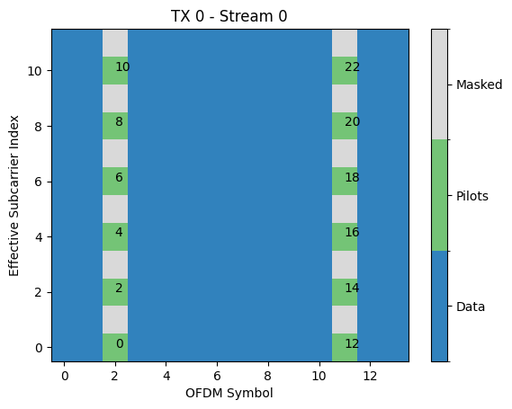

Orthogonal Frequency-Division Multiplexing (OFDM)
#################################################

This module provides layers and functions to support
simulation of OFDM-based systems. The key component is the
:class:`~sionna.ofdm.ResourceGrid` that defines how data and pilot symbols
are mapped onto a sequence of OFDM symbols with a given FFT size. The resource
grid can also define guard and DC carriers which are nulled. In 4G/5G parlance,
a :class:`~sionna.ofdm.ResourceGrid` would be a slot.
Once a :class:`~sionna.ofdm.ResourceGrid` is defined, one can use the
:class:`~sionna.ofdm.ResourceGridMapper` to map a tensor of complex-valued
data symbols onto the resource grid, prior to OFDM modulation using the
:class:`~sionna.ofdm.OFDMModulator` or further processing in the
frequency domain.

The :class:`~sionna.ofdm.PilotPattern` allows for a fine-grained configuration
of how transmitters send pilots for each of their streams or antennas. As the
management of pilots in multi-cell MIMO setups can quickly become complicated,
the module provides the :class:`~sionna.ofdm.KroneckerPilotPattern` class
that automatically generates orthogonal pilot transmissions for all transmitters
and streams.

Additionally, the module contains layers for channel estimation, precoding,
equalization, and detection,
such as the :class:`~sionna.ofdm.LSChannelEstimator`, the
:class:`~sionna.ofdm.ZFPrecoder`, and the :class:`~sionna.ofdm.LMMSEEqualizer` and
:class:`~sionna.ofdm.LinearDetector`.
These are good starting points for the development of more advanced algorithms
and provide robust baselines for benchmarking.

Resource Grid
*************

The following code snippet shows how to setup and visualize an instance of
:class:`~sionna.ofdm.ResourceGrid`:

.. code-block:: Python

   rg = ResourceGrid(num_ofdm_symbols = 14,
                     fft_size = 64,
                     subcarrier_spacing = 30e3,
                     num_tx = 1,
                     num_streams_per_tx = 1,
                     num_guard_carriers = [5, 6],
                     dc_null = True,
                     pilot_pattern = "kronecker",
                     pilot_ofdm_symbol_indices = [2, 11])
   rg.show();

This code creates a resource grid consisting of 14 OFDM symbols with 64
subcarriers. The first five and last six subcarriers as well as the DC
subcarriers are nulled. The second and eleventh OFDM symbol are reserved
for pilot transmissions.

Subcarriers are numbered from :math:`0` to :math:`N-1`, where :math:`N`
is the FTT size. The index :math:`0` corresponds to the lowest frequency,
which is :math:`-\frac{N}{2}\Delta_f` (for :math:`N` even) or
:math:`-\frac{N-1}{2}\Delta_f` (for :math:`N` odd), where :math:`\Delta_f`
is the subcarrier spacing which is irrelevant for the resource grid.
The index :math:`N-1` corresponds to the highest frequency,
which is :math:`(\frac{N}{2}-1)\Delta_f` (for :math:`N` even) or
:math:`\frac{N-1}{2}\Delta_f` (for :math:`N` odd).

ResourceGrid
------------
.. autoclass:: sionna.ofdm.ResourceGrid
   :members:

ResourceGridMapper
------------------
.. autoclass:: sionna.ofdm.ResourceGridMapper
   :exclude-members: call, build
   :members:

ResourceGridDemapper
--------------------
.. autoclass:: sionna.ofdm.ResourceGridDemapper
   :exclude-members: call, build
   :members:

RemoveNulledSubcarriers
-----------------------
.. autoclass:: sionna.ofdm.RemoveNulledSubcarriers
   :exclude-members: call, build
   :members:

Modulation & Demodulation
*************************

OFDMModulator
-------------
.. autoclass:: sionna.ofdm.OFDMModulator
   :exclude-members: call, build
   :members:

OFDMDemodulator
---------------
.. autoclass:: sionna.ofdm.OFDMDemodulator
   :exclude-members: call, build
   :members:

Pilot Pattern
*************
A :class:`~sionna.ofdm.PilotPattern` defines how transmitters send pilot
sequences for each of their antennas or streams over an OFDM resource grid.
It consists of two components,
a ``mask`` and ``pilots``. The ``mask`` indicates which resource elements are
reserved for pilot transmissions by each transmitter and its respective
streams. In some cases, the number of streams is equal to the number of
transmit antennas, but this does not need to be the case, e.g., for precoded
transmissions. The ``pilots`` contains the pilot symbols that are transmitted
at the positions indicated by the ``mask``. Separating a pilot pattern into
``mask`` and ``pilots`` enables the implementation of a wide range of pilot
configurations, including trainable pilot sequences.

The following code snippet shows how to define a simple custom
:class:`~sionna.ofdm.PilotPattern` for single transmitter, sending two streams
Note that ``num_effective_subcarriers`` is the number of subcarriers that
can be used for data or pilot transmissions. Due to guard
carriers or a nulled DC carrier, this number can be smaller than the
``fft_size`` of the :class:`~sionna.ofdm.ResourceGrid`.

.. code-block:: Python

   num_tx = 1
   num_streams_per_tx = 2
   num_ofdm_symbols = 14
   num_effective_subcarriers = 12

   # Create a pilot mask
   mask = np.zeros([num_tx,
                    num_streams_per_tx,
                    num_ofdm_symbols,
                    num_effective_subcarriers])
   mask[0, :, [2,11], :] = 1
   num_pilot_symbols = int(np.sum(mask[0,0]))

   # Define pilot sequences
   pilots = np.zeros([num_tx,
                      num_streams_per_tx,
                      num_pilot_symbols], np.complex64)
   pilots[0, 0, 0:num_pilot_symbols:2] = (1+1j)/np.sqrt(2)
   pilots[0, 1, 1:num_pilot_symbols:2] = (1+1j)/np.sqrt(2)

   # Create a PilotPattern instance
   pp = PilotPattern(mask, pilots)

   # Visualize non-zero elements of the pilot sequence
   pp.show(show_pilot_ind=True);

As shown in the figures above, the pilots are mapped onto the mask from
the smallest effective subcarrier and OFDM symbol index to the highest
effective subcarrier and OFDM symbol index. Here, boths stream have 24
pilot symbols, out of which only 12 are nonzero. It is important to keep
this order of mapping in mind when designing more complex pilot sequences.

PilotPattern
------------
.. autoclass:: sionna.ofdm.PilotPattern
   :members:

EmptyPilotPattern
-----------------
.. autoclass:: sionna.ofdm.EmptyPilotPattern
   :members:

KroneckerPilotPattern
---------------------
.. autoclass:: sionna.ofdm.KroneckerPilotPattern
   :members:

Channel Estimation
******************

BaseChannelEstimator
--------------------
.. autoclass:: sionna.ofdm.BaseChannelEstimator
   :exclude-members: call, build
   :members:

BaseChannelInterpolator
------------------------
.. autoclass:: sionna.ofdm.BaseChannelInterpolator
   :exclude-members: call, build
   :members:

LSChannelEstimator
------------------
.. autoclass:: sionna.ofdm.LSChannelEstimator
   :exclude-members: call, build, estimate_at_pilot_locations
   :members:

LinearInterpolator
-------------------
.. autoclass:: sionna.ofdm.LinearInterpolator
   :members:

LMMSEInterpolator
-------------------
.. autoclass:: sionna.ofdm.LMMSEInterpolator
   :members:

NearestNeighborInterpolator
---------------------------
.. autoclass:: sionna.ofdm.NearestNeighborInterpolator
   :members:

tdl_time_cov_mat
-----------------
.. autofunction:: sionna.ofdm.tdl_time_cov_mat

tdl_freq_cov_mat
-----------------
.. autofunction:: sionna.ofdm.tdl_freq_cov_mat

Precoding
*********

ZFPrecoder
----------
.. autoclass:: sionna.ofdm.ZFPrecoder
   :exclude-members: call, build
   :members:

Equalization
************

OFDMEqualizer
--------------
.. autoclass:: sionna.ofdm.OFDMEqualizer
   :exclude-members: call, build
   :members:

LMMSEEqualizer
--------------
.. autoclass:: sionna.ofdm.LMMSEEqualizer
   :exclude-members: call, build
   :members:

MFEqualizer
------------
.. autoclass:: sionna.ofdm.MFEqualizer
   :exclude-members: call, build
   :members:

ZFEqualizer
------------
.. autoclass:: sionna.ofdm.ZFEqualizer
   :exclude-members: call, build
   :members:

Detection
**********

OFDMDetector
-------------
.. autoclass:: sionna.ofdm.OFDMDetector
   :exclude-members: call, build
   :members:

OFDMDetectorWithPrior
-----------------------
.. autoclass:: sionna.ofdm.OFDMDetectorWithPrior
   :exclude-members: call, build
   :members:

EPDetector
---------------
.. autoclass:: sionna.ofdm.EPDetector
   :exclude-members: call, build
   :members:

KBestDetector
---------------
.. autoclass:: sionna.ofdm.KBestDetector
   :exclude-members: call, build
   :members:

LinearDetector
---------------
.. autoclass:: sionna.ofdm.LinearDetector
   :exclude-members: call, build
   :members:

MaximumLikelihoodDetector
----------------------------
.. autoclass:: sionna.ofdm.MaximumLikelihoodDetector
   :exclude-members: call, build
   :members:

MaximumLikelihoodDetectorWithPrior
------------------------------------
.. autoclass:: sionna.ofdm.MaximumLikelihoodDetectorWithPrior
   :exclude-members: call, build
   :members:

MMSEPICDetector
----------------
.. autoclass:: sionna.ofdm.MMSEPICDetector
   :exclude-members: call, build
   :members:
