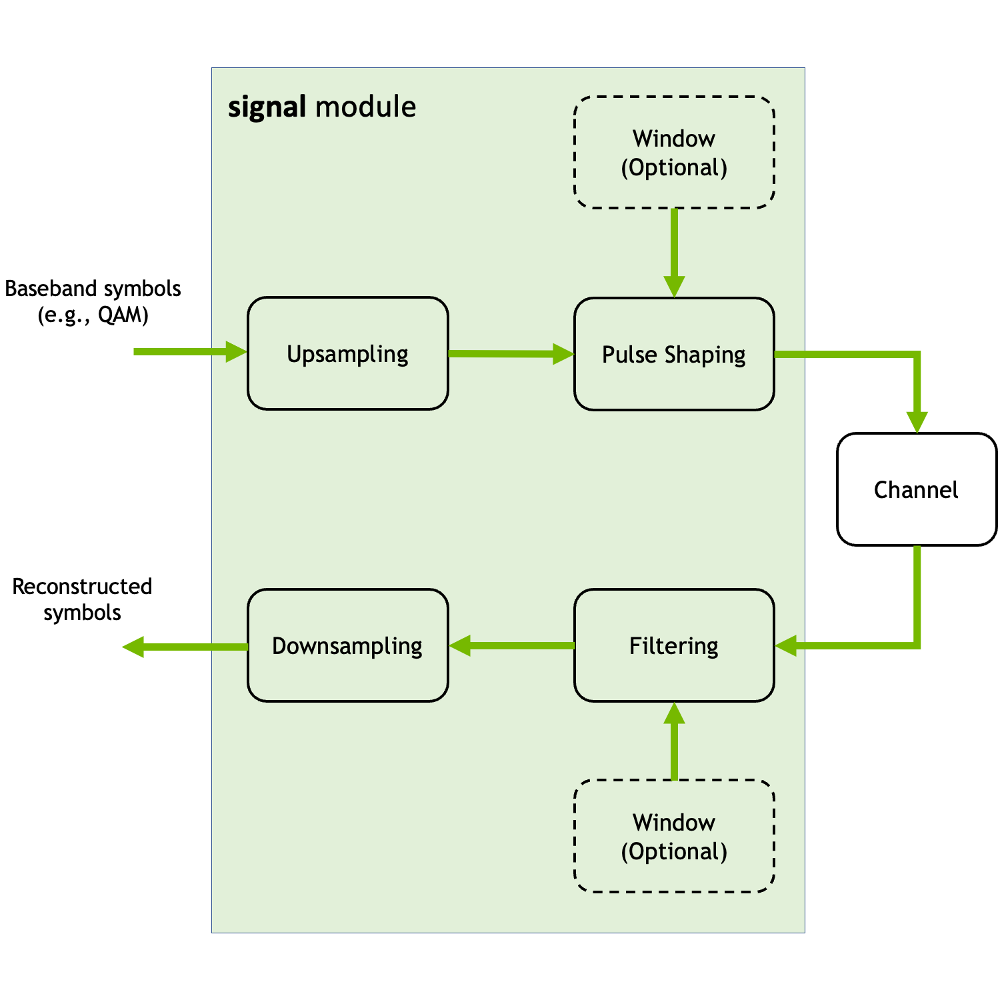

========
Signal
========

This module contains classes and functions for :ref:`filtering <filter>` (pulse shaping), :ref:`windowing <window>`, and :ref:`up- <upsampling>` and :ref:`downsampling <downsampling>`.
The following figure shows the different components that can be implemented using this module.

This module also contains :ref:`utility functions <utility>` for computing the (inverse) discrete Fourier transform (:ref:`FFT <fft>`/:ref:`IFFT <ifft>`), and for empirically computing the :ref:`power spectral density (PSD) <empirical_psd>` and :ref:`adjacent channel leakage ratio (ACLR) <empirical_aclr>` of a signal.

The following code snippet shows how to filter a sequence of QAM baseband symbols using a root-raised-cosine filter with a Hann window:

.. code-block:: Python

   # Create batch of QAM-16 sequences 
   batch_size = 128
   num_symbols = 1000
   num_bits_per_symbol = 4
   x = QAMSource(num_bits_per_symbol)([batch_size, num_symbols])

   # Create a root-raised-cosine filter with Hann windowing
   beta = 0.22 # Roll-off factor
   span_in_symbols = 32 # Filter span in symbols
   samples_per_symbol = 4 # Number of samples per symbol, i.e., the oversampling factor
   rrcf_hann = RootRaisedCosineFilter(span_in_symbols, samples_per_symbol, beta, window="hann")

   # Create instance of the Upsampling layer
   us = Upsampling(samples_per_symbol)

   # Upsample the baseband x
   x_us = us(x)

   # Filter the upsampled sequence
   x_rrcf = rrcf_hann(x_us)

On the receiver side, one would recover the baseband symbols as follows:

.. code-block:: Python

   # Instantiate a downsampling layer
   ds = Downsampling(samples_per_symbol, rrcf_hann.length-1, num_symbols)

   # Apply the matched filter
   x_mf = rrcf_hann(x_rrcf)
   
   # Recover the transmitted symbol sequence
   x_hat = ds(x_mf)

.. _filter:

Filters
========

SincFilter
------------

.. autoclass:: sionna.signal.SincFilter
   :members: length, window, normalize, trainable, coefficients, sampling_times, show, aclr
   :exclude-members: call, build

RaisedCosineFilter
--------------------

.. autoclass:: sionna.signal.RaisedCosineFilter
   :members: length, window, normalize, trainable, coefficients, sampling_times, show, aclr, beta
   :exclude-members: call, build

RootRaisedCosineFilter
------------------------

.. autoclass:: sionna.signal.RootRaisedCosineFilter
   :members: length, window, normalize, trainable, coefficients, sampling_times, show, aclr, beta
   :exclude-members: call, build

CustomFilter
--------------

.. autoclass:: sionna.signal.CustomFilter
   :members: length, window, normalize, trainable, coefficients, sampling_times, show, aclr
   :exclude-members: call, build

Filter
---------

.. autoclass:: sionna.signal.Filter
   :members:
   :exclude-members: call, build

.. _window:

Window functions
=================

HannWindow
------------

.. autoclass:: sionna.signal.HannWindow
   :members: coefficients, length, trainable, normalize, show
   :exclude-members: call, build

HammingWindow
---------------

.. autoclass:: sionna.signal.HammingWindow
   :members: coefficients, length, trainable, normalize, show
   :exclude-members: call, build

BlackmanWindow
----------------

.. autoclass:: sionna.signal.BlackmanWindow
   :members: coefficients, length, trainable, normalize, show
   :exclude-members: call, build

CustomWindow
--------------

.. autoclass:: sionna.signal.CustomWindow
   :members: coefficients, length, trainable, normalize, show
   :exclude-members: call, build

Window
---------

.. autoclass:: sionna.signal.Window
   :members:
   :exclude-members: call, build

.. _utility:

Utility Functions
=================

convolve
---------

.. autofunction:: sionna.signal.convolve

.. _fft:

fft
----

.. autofunction:: sionna.signal.fft

.. _ifft:

ifft
-----

.. autofunction:: sionna.signal.ifft

.. _upsampling:

Upsampling
-------------

.. autoclass:: sionna.signal.Upsampling
   :members:
   :exclude-members: call, build

.. _downsampling:

Downsampling
-------------

.. autoclass:: sionna.signal.Downsampling
   :members:
   :exclude-members: call, build

.. _empirical_psd:

empirical_psd
-------------

.. autofunction:: sionna.signal.empirical_psd

.. _empirical_aclr:

empirical_aclr
---------------

.. autofunction:: sionna.signal.empirical_aclr
