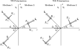
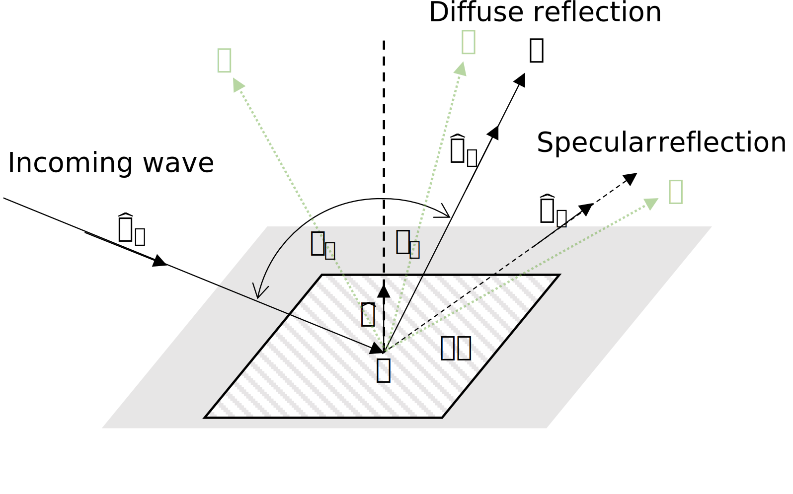
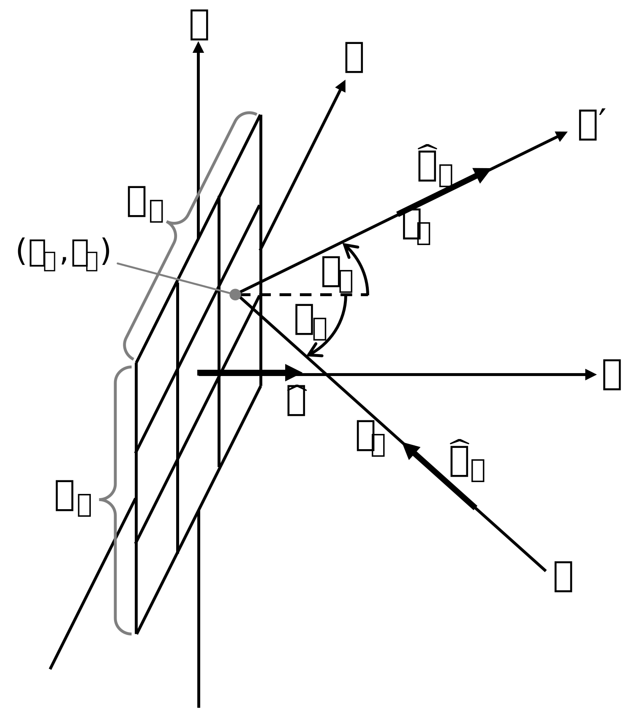
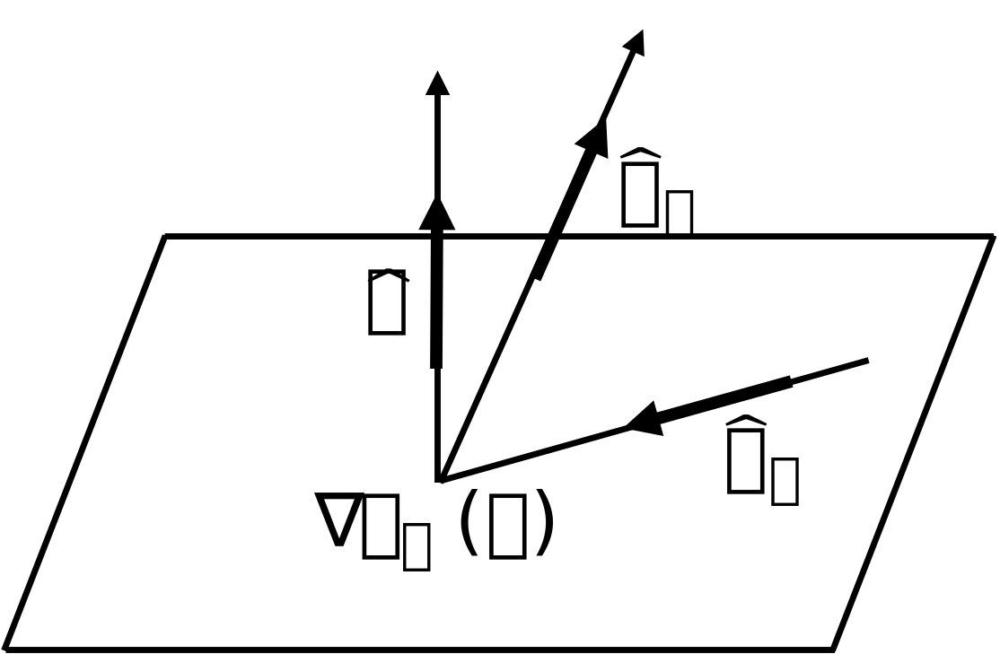
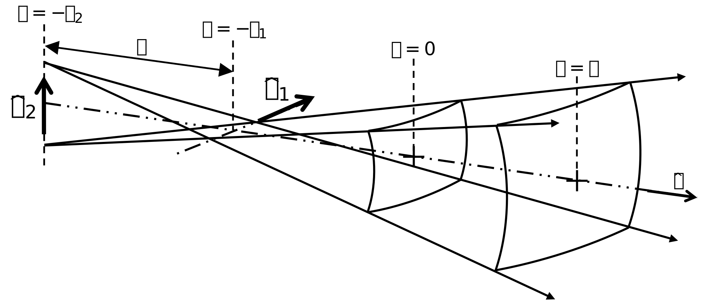

Primer on Electromagnetics
##########################

This section provides useful background for the general understanding of ray tracing for wireless propagation modelling. In particular, our goal is to provide a concise definition of a `channel impulse response` between a transmitting and receiving antenna, as done in (Ch. 2 & 3) [Wiesbeck]_. The notations and definitions will be used in the API documentation of Sionna's :doc:`Ray Tracing module <api/rt>`.

Coordinate system, rotations, and vector fields
***********************************************

We consider a global coordinate system (GCS) with Cartesian standard basis :math:`\hat{\mathbf{x}}`, :math:`\hat{\mathbf{y}}`, :math:`\hat{\mathbf{z}}`.
The spherical unit vectors are defined as

.. math::
    :label: spherical_vecs

    \begin{align}
        \hat{\mathbf{r}}          (\theta, \varphi) &= \sin(\theta)\cos(\varphi) \hat{\mathbf{x}} + \sin(\theta)\sin(\varphi) \hat{\mathbf{y}} + \cos(\theta)\hat{\mathbf{z}}\\
        \hat{\boldsymbol{\theta}} (\theta, \varphi) &= \cos(\theta)\cos(\varphi) \hat{\mathbf{x}} + \cos(\theta)\sin(\varphi) \hat{\mathbf{y}} - \sin(\theta)\hat{\mathbf{z}}\\
        \hat{\boldsymbol{\varphi}}(\theta, \varphi) &=            -\sin(\varphi) \hat{\mathbf{x}} +             \cos(\varphi) \hat{\mathbf{y}}.
    \end{align}

For an arbitrary unit norm vector :math:`\hat{\mathbf{v}} = (x, y, z)`, the zenith and azimuth angles :math:`\theta` and :math:`\varphi` can be computed as

.. math::
    :label: theta_phi

    \theta  &= \cos^{-1}(z) \\
    \varphi &= \mathop{\text{atan2}}(y, x)

where :math:`\mathop{\text{atan2}}(y, x)` is the two-argument inverse tangent function [atan2]_. As any vector uniquely determines :math:`\theta` and :math:`\varphi`, we sometimes also
write :math:`\hat{\boldsymbol{\theta}}(\hat{\mathbf{v}})` and :math:`\hat{\boldsymbol{\varphi}}(\hat{\mathbf{v}})` instead of :math:`\hat{\boldsymbol{\theta}} (\theta, \varphi)` and :math:`\hat{\boldsymbol{\varphi}}(\theta, \varphi)`.

A 3D rotation with yaw, pitch, and roll angles :math:`\alpha`, :math:`\beta`, and :math:`\gamma`, respectively, is expressed by the matrix

.. math::
    :label: rotation

    \begin{align}
        \mathbf{R}(\alpha, \beta, \gamma) = \mathbf{R}_z(\alpha)\mathbf{R}_y(\beta)\mathbf{R}_x(\gamma)
    \end{align}

where :math:`\mathbf{R}_z(\alpha)`, :math:`\mathbf{R}_y(\beta)`, and :math:`\mathbf{R}_x(\gamma)` are rotation matrices around the :math:`z`, :math:`y`, and :math:`x` axes, respectively, which are defined as

.. math::
    \begin{align}
        \mathbf{R}_z(\alpha) &= \begin{pmatrix}
                        \cos(\alpha) & -\sin(\alpha) & 0\\
                        \sin(\alpha) & \cos(\alpha) & 0\\
                        0 & 0 & 1
                      \end{pmatrix}\\
        \mathbf{R}_y(\beta) &= \begin{pmatrix}
                        \cos(\beta) & 0 & \sin(\beta)\\
                        0 & 1 & 0\\
                        -\sin(\beta) & 0 & \cos(\beta)
                      \end{pmatrix}\\
        \mathbf{R}_x(\gamma) &= \begin{pmatrix}
                            1 & 0 & 0\\
                            0 & \cos(\gamma) & -\sin(\gamma)\\
                            0 & \sin(\gamma) & \cos(\gamma)
                      \end{pmatrix}.
    \end{align}

A closed-form expression for :math:`\mathbf{R}(\alpha, \beta, \gamma)` can be found in (7.1-4) [TR38901]_.
The reverse rotation is simply defined by :math:`\mathbf{R}^{-1}(\alpha, \beta, \gamma)=\mathbf{R}^\mathsf{T}(\alpha, \beta, \gamma)`.
A vector :math:`\mathbf{x}` defined in a first coordinate system is represented in a second coordinate system rotated by :math:`\mathbf{R}(\alpha, \beta, \gamma)` with respect to the first one as :math:`\mathbf{x}'=\mathbf{R}^\mathsf{T}(\alpha, \beta, \gamma)\mathbf{x}`.
If a point in the first coordinate system has spherical angles :math:`(\theta, \varphi)`, the corresponding angles :math:`(\theta', \varphi')` in the second coordinate system can be found to be

.. math::
    :label: theta_phi_prime

    \begin{align}
        \theta' &= \cos^{-1}\left( \hat{\mathbf{z}}^\mathsf{T} \mathbf{R}^\mathsf{T}(\alpha, \beta, \gamma)\hat{\mathbf{r}}(\theta, \varphi)          \right)\\
        \varphi' &= \arg\left( \left( \hat{\mathbf{x}} + j\hat{\mathbf{y}}\right)^\mathsf{T} \mathbf{R}^\mathsf{T}(\alpha, \beta, \gamma)\hat{\mathbf{r}}(\theta, \varphi) \right).
    \end{align}

For a vector field :math:`\mathbf{F}'(\theta',\varphi')` expressed in local spherical coordinates

.. math::
    \mathbf{F}'(\theta',\varphi') = F_{\theta'}(\theta',\varphi')\hat{\boldsymbol{\theta}}'(\theta',\varphi') + F_{\varphi'}(\theta',\varphi')\hat{\boldsymbol{\varphi}}'(\theta',\varphi')

that are rotated by :math:`\mathbf{R}=\mathbf{R}(\alpha, \beta, \gamma)` with respect to the GCS, the spherical field components in the GCS can be expressed as

.. math::
    :label: F_prime_2_F

    \begin{bmatrix}
        F_\theta(\theta, \varphi) \\
        F_\varphi(\theta, \varphi)
    \end{bmatrix} =
    \begin{bmatrix}
        \hat{\boldsymbol{\theta}}(\theta,\varphi)^\mathsf{T}\mathbf{R}\hat{\boldsymbol{\theta}}'(\theta',\varphi') & \hat{\boldsymbol{\theta}}(\theta,\varphi)^\mathsf{T}\mathbf{R}\hat{\boldsymbol{\varphi}}'(\theta',\varphi') \\
        \hat{\boldsymbol{\varphi}}(\theta,\varphi)^\mathsf{T}\mathbf{R}\hat{\boldsymbol{\theta}}'(\theta',\varphi') & \hat{\boldsymbol{\varphi}}(\theta,\varphi)^\mathsf{T}\mathbf{R}\hat{\boldsymbol{\varphi}}'(\theta',\varphi')
    \end{bmatrix}
    \begin{bmatrix}
        F_{\theta'}(\theta', \varphi') \\
        F_{\varphi'}(\theta', \varphi')
    \end{bmatrix}

so that

.. math::
    \mathbf{F}(\theta,\varphi) = F_{\theta}(\theta,\varphi)\hat{\boldsymbol{\theta}}(\theta,\varphi) + F_{\varphi}(\theta,\varphi)\hat{\boldsymbol{\varphi}}(\theta,\varphi).

It sometimes also useful to find the rotation matrix that maps a unit vector :math:`\hat{\mathbf{a}}` to :math:`\hat{\mathbf{b}}`. This can be achieved with the help of Rodrigues' rotation formula [Wikipedia_Rodrigues]_ which defines the matrix

.. math::
    :label: rodrigues_matrix

    \mathbf{R}(\hat{\mathbf{a}}, \hat{\mathbf{b}}) = \mathbf{I} + \sin(\theta)\mathbf{K} + (1-\cos(\theta)) \mathbf{K}^2

where

.. math::
    \mathbf{K} &= \begin{bmatrix}
                            0 & -\hat{k}_z &  \hat{k}_y \\
                    \hat{k}_z &          0 & -\hat{k}_x \\
                   -\hat{k}_y &  \hat{k}_x &          0
                 \end{bmatrix}\\
    \hat{\mathbf{k}} &= \frac{\hat{\mathbf{a}} \times \hat{\mathbf{b}}}{\lVert \hat{\mathbf{a}} \times \hat{\mathbf{b}} \rVert}\\
    \theta &=\hat{\mathbf{a}}^\mathsf{T}\hat{\mathbf{b}}

such that :math:`\mathbf{R}(\hat{\mathbf{a}}, \hat{\mathbf{b}})\hat{\mathbf{a}}=\hat{\mathbf{b}}`.

Planar Time-Harmonic Waves
**************************

A time-harmonic planar electric wave :math:`\mathbf{E}(\mathbf{x}, t)\in\mathbb{C}^3` travelling in a homogeneous medium with wave vector :math:`\mathbf{k}\in\mathbb{C}^3` can be described at position :math:`\mathbf{x}\in\mathbb{R}^3` and time :math:`t` as

.. math::
    \begin{align}
        \mathbf{E}(\mathbf{x}, t) &= \mathbf{E}_0 e^{j(\omega t -\mathbf{k}^{\mathsf{H}}\mathbf{x})}\\
                                  &= \mathbf{E}(\mathbf{x}) e^{j\omega t}
    \end{align}

where :math:`\mathbf{E}_0\in\mathbb{C}^3` is the field phasor. The wave vector can be decomposed as :math:`\mathbf{k}=k \hat{\mathbf{k}}`, where :math:`\hat{\mathbf{k}}` is a unit norm vector, :math:`k=\omega\sqrt{\varepsilon\mu}` is the wave number, and :math:`\omega=2\pi f` is the angular frequency. The permittivity :math:`\varepsilon` and permeability :math:`\mu` are defined as

.. math::
    :label: epsilon

    \varepsilon = \eta \varepsilon_0

.. math::
    :label: mu

    \mu = \mu_r \mu_0

where :math:`\eta` and :math:`\varepsilon_0` are the complex relative and vacuum permittivities, :math:`\mu_r` and :math:`\mu_0` are the relative and vacuum permeabilities, and :math:`\sigma` is the conductivity.
The complex relative permittivity :math:`\eta` is given as

.. math::
    :label: eta

    \eta = \varepsilon_r - j\frac{\sigma}{\varepsilon_0\omega}

where :math:`\varepsilon_r` is the real relative permittivity of a non-conducting dielectric.

With these definitions, the speed of light is given as (Eq. 4-28d) [Balanis]_

.. math::
    c=\frac{1}{\sqrt{\varepsilon_0\varepsilon_r\mu}}\left\{\frac12\left(\sqrt{1+\left(\frac{\sigma}{\omega\varepsilon_0\varepsilon_r}\right)^2}+1\right)\right\}^{-\frac{1}{2}}

where the factor in curly brackets vanishes for non-conducting materials. The speed of light in vacuum is denoted :math:`c_0=\frac{1}{\sqrt{\varepsilon_0 \mu_0}}` and the vacuum wave number :math:`k_0=\frac{\omega}{c_0}`. In conducting materials, the wave number is complex which translates to propagation losses.

The associated magnetic field :math:`\mathbf{H}(\mathbf{x}, t)\in\mathbb{C}^3` is

.. math::
    \mathbf{H}(\mathbf{x}, t) = \frac{\hat{\mathbf{k}}\times  \mathbf{E}(\mathbf{x}, t)}{Z} = \mathbf{H}(\mathbf{x})e^{j\omega t}

where :math:`Z=\sqrt{\mu/\varepsilon}` is the wave impedance. The vacuum impedance is denoted by :math:`Z_0=\sqrt{\mu_0/\varepsilon_0}\approx 376.73\,\Omega`.

The time-averaged Poynting vector is defined as

.. math::
        \mathbf{S}(\mathbf{x}) = \frac{1}{2} \Re\left\{\mathbf{E}(\mathbf{x})\times  \mathbf{H}(\mathbf{x})\right\}
                               = \frac{1}{2} \Re\left\{\frac{1}{Z} \right\} \lVert \mathbf{E}(\mathbf{x})  \rVert^2 \hat{\mathbf{k}}

which describes the directional energy flux (W/m²), i.e., energy transfer per unit area per unit time.

Note that the actual electromagnetic waves are the real parts of :math:`\mathbf{E}(\mathbf{x}, t)` and :math:`\mathbf{H}(\mathbf{x}, t)`.

.. _far_field:

Far Field of a Transmitting Antenna
***********************************

We assume that the electric far field of an antenna in free space can be described by a spherical wave originating from the center of the antenna:

.. math::
    \mathbf{E}(r, \theta, \varphi, t) = \mathbf{E}(r,\theta, \varphi) e^{j\omega t} = \mathbf{E}_0(\theta, \varphi) \frac{e^{-jk_0r}}{r} e^{j\omega t}

where :math:`\mathbf{E}_0(\theta, \varphi)` is the electric field phasor, :math:`r` is the distance (or radius), :math:`\theta` the zenith angle, and :math:`\varphi` the azimuth angle.
In contrast to a planar wave, the field strength decays as :math:`1/r`.

The complex antenna field pattern :math:`\mathbf{F}(\theta, \varphi)` is defined as

.. math::
    :label: F

    \begin{align}
        \mathbf{F}(\theta, \varphi) = \frac{ \mathbf{E}_0(\theta, \varphi)}{\max_{\theta,\varphi}\lVert  \mathbf{E}_0(\theta, \varphi) \rVert}.
    \end{align}

The time-averaged Poynting vector for such a spherical wave is

.. math::
    :label: S_spherical

    \mathbf{S}(r, \theta, \varphi) = \frac{1}{2Z_0}\lVert \mathbf{E}(r, \theta, \varphi) \rVert^2 \hat{\mathbf{r}}

where :math:`\hat{\mathbf{r}}` is the radial unit vector. It simplifies for an ideal isotropic antenna with input power :math:`P_\text{T}` to

.. math::
    \mathbf{S}_\text{iso}(r, \theta, \varphi) = \frac{P_\text{T}}{4\pi r^2} \hat{\mathbf{r}}.

The antenna gain :math:`G` is the ratio of the maximum radiation power density of the antenna in radial direction and that of an ideal isotropic radiating antenna:

.. math::
    :label: G

        G = \frac{\max_{\theta,\varphi}\lVert \mathbf{S}(r, \theta, \varphi)\rVert}{ \lVert\mathbf{S}_\text{iso}(r, \theta, \varphi)\rVert}
          = \frac{2\pi}{Z_0 P_\text{T}} \max_{\theta,\varphi}\lVert \mathbf{E}_0(\theta, \varphi) \rVert^2.

One can similarly define a gain with directional dependency by ignoring the computation of the maximum the last equation:

.. math::
    :label: Gdir

        G(\theta, \varphi) = \frac{2\pi}{Z_0 P_\text{T}} \lVert \mathbf{E}_0(\theta, \varphi) \rVert^2 = G \lVert \mathbf{F}(\theta, \varphi) \rVert^2.

If one uses in the last equation the radiated power :math:`P=\eta_\text{rad} P_\text{T}`, where :math:`\eta_\text{rad}` is the radiation efficiency, instead of the input power :math:`P_\text{T}`, one obtains the directivity :math:`D(\theta,\varphi)`. Both are related through :math:`G(\theta, \varphi)=\eta_\text{rad} D(\theta, \varphi)`.

.. admonition:: Antenna pattern

    Since :math:`\mathbf{F}(\theta, \varphi)` contains no information about the maximum gain :math:`G` and :math:`G(\theta, \varphi)` does not carry any phase information, we define the `antenna pattern` :math:`\mathbf{C}(\theta, \varphi)` as

    .. math::
        :label: C

        \mathbf{C}(\theta, \varphi) = \sqrt{G}\mathbf{F}(\theta, \varphi)

    such that :math:`G(\theta, \varphi)= \lVert\mathbf{C}(\theta, \varphi) \rVert^2`.

    Using the spherical unit vectors :math:`\hat{\boldsymbol{\theta}}\in\mathbb{R}^3`
    and :math:`\hat{\boldsymbol{\varphi}}\in\mathbb{R}^3`,
    we can rewrite :math:`\mathbf{C}(\theta, \varphi)` as

    .. math::
        \mathbf{C}(\theta, \varphi) = C_\theta(\theta,\varphi) \hat{\boldsymbol{\theta}} + C_\varphi(\theta,\varphi) \hat{\boldsymbol{\varphi}}

    where :math:`C_\theta(\theta,\varphi)\in\mathbb{C}` and :math:`C_\varphi(\theta,\varphi)\in\mathbb{C}` are the
    `zenith pattern` and `azimuth pattern`, respectively.

Combining :eq:`F` and :eq:`G`, we can obtain the following expression of the electric far field

.. math::
    :label: E_T

    \mathbf{E}_\text{T}(r,\theta_\text{T},\varphi_\text{T}) = \sqrt{ \frac{P_\text{T} G_\text{T} Z_0}{2\pi}} \frac{e^{-jk_0 r}}{r} \mathbf{F}_\text{T}(\theta_\text{T}, \varphi_\text{T})

where we have added the subscript :math:`\text{T}` to all quantities that are specific to the transmitting antenna.

The input power :math:`P_\text{T}` of an antenna with (conjugate matched) impedance :math:`Z_\text{T}`, fed by a voltage source with complex amplitude :math:`V_\text{T}`, is given by (see, e.g., [Wikipedia]_)

.. math::
    :label: P_T

    P_\text{T} = \frac{|V_\text{T}|^2}{8\Re\{Z_\text{T}\}}.

.. admonition:: Normalization of antenna patterns

    The radiated power :math:`\eta_\text{rad} P_\text{T}` of an antenna can be obtained by integrating the Poynting vector over the surface of a closed sphere of radius :math:`r` around the antenna:

    .. math::
        \begin{align}
            \eta_\text{rad} P_\text{T} &=  \int_0^{2\pi}\int_0^{\pi} \mathbf{S}(r, \theta, \varphi)^\mathsf{T} \hat{\mathbf{r}} r^2 \sin(\theta)d\theta d\varphi \\
                            &= \int_0^{2\pi}\int_0^{\pi} \frac{1}{2Z_0} \lVert \mathbf{E}(r, \theta, \varphi) \rVert^2 r^2\sin(\theta)d\theta d\varphi \\
                            &= \frac{P_\text{T}}{4 \pi} \int_0^{2\pi}\int_0^{\pi} G(\theta, \varphi) \sin(\theta)d\theta d\varphi.
        \end{align}

    We can see from the last equation that the directional gain of any antenna must satisfy

    .. math::
        \int_0^{2\pi}\int_0^{\pi} G(\theta, \varphi) \sin(\theta)d\theta d\varphi = 4 \pi \eta_\text{rad}.

Modelling of a Receiving Antenna
********************************

Although the transmitting antenna radiates a spherical wave :math:`\mathbf{E}_\text{T}(r,\theta_\text{T},\varphi_\text{T})`,
we assume that the receiving antenna observes a planar incoming wave :math:`\mathbf{E}_\text{R}` that arrives from the angles :math:`\theta_\text{R}` and :math:`\varphi_\text{R}`
which are defined in the local spherical coordinates of the receiving antenna. The Poynting vector of the incoming wave :math:`\mathbf{S}_\text{R}` is hence :eq:`S_spherical`

.. math::
    :label: S_R

    \mathbf{S}_\text{R} = -\frac{1}{2Z_0} \lVert \mathbf{E}_\text{R} \rVert^2 \hat{\mathbf{r}}(\theta_\text{R}, \varphi_\text{R})

where :math:`\hat{\mathbf{r}}(\theta_\text{R}, \varphi_\text{R})` is the radial unit vector in the spherical coordinate system of the receiver.

The aperture or effective area :math:`A_\text{R}` of an antenna with gain :math:`G_\text{R}` is defined as the ratio of the available received power :math:`P_\text{R}` at the output of the antenna and the absolute value of the Poynting vector, i.e., the power density:

.. math::
    :label: A_R

    A_\text{R} = \frac{P_\text{R}}{\lVert \mathbf{S}_\text{R}\rVert} = G_\text{R}\frac{\lambda^2}{4\pi}

where :math:`\frac{\lambda^2}{4\pi}` is the aperture of an isotropic antenna. In the definition above, it is assumed that the antenna is ideally directed towards and polarization matched to the incoming wave.
For an arbitrary orientation of the antenna (but still assuming polarization matching), we can define a direction dependent effective area

.. math::
    :label: A_dir

    A_\text{R}(\theta_\text{R}, \varphi_\text{R}) = G_\text{R}(\theta_\text{R}, \varphi_\text{R})\frac{\lambda^2}{4\pi}.

The available received power at the output of the antenna can be expressed as

.. math::
    :label: P_R

    P_\text{R} = \frac{|V_\text{R}|^2}{8\Re\{Z_\text{R}\}}

where :math:`Z_\text{R}` is the impedance of the receiving antenna and :math:`V_\text{R}` the open circuit voltage.

We can now combine :eq:`P_R`, :eq:`A_dir`, and :eq:`A_R` to obtain the following expression for the absolute value of the voltage :math:`|V_\text{R}|`
assuming matched polarization:

.. math::
    \begin{align}
        |V_\text{R}| &= \sqrt{P_\text{R} 8\Re\{Z_\text{R}\}}\\
                     &= \sqrt{\frac{\lambda^2}{4\pi} G_\text{R}(\theta_\text{R}, \varphi_\text{R}) \frac{8\Re\{Z_\text{R}\}}{2 Z_0} \lVert \mathbf{E}_\text{R} \rVert^2}\\
                     &= \sqrt{\frac{\lambda^2}{4\pi} G_\text{R} \frac{4\Re\{Z_\text{R}\}}{Z_0}} \lVert \mathbf{F}_\text{R}(\theta_\text{R}, \varphi_\text{R})\rVert\lVert\mathbf{E}_\text{R}\rVert.
    \end{align}

By extension of the previous equation, we can obtain an expression for :math:`V_\text{R}` which is valid for
arbitrary polarizations of the incoming wave and the receiving antenna:

.. math::
    :label: V_R

    V_\text{R} = \sqrt{\frac{\lambda^2}{4\pi} G_\text{R} \frac{4\Re\{Z_\text{R}\}}{Z_0}} \mathbf{F}_\text{R}(\theta_\text{R}, \varphi_\text{R})^{\mathsf{H}}\mathbf{E}_\text{R}.

.. admonition:: Example: Recovering Friis equation

    In the case of free space propagation, we have :math:`\mathbf{E}_\text{R}=\mathbf{E}_\text{T}(r,\theta_\text{T},\varphi_\text{T})`.
    Combining :eq:`V_R`, :eq:`P_R`, and :eq:`E_T`, we obtain the following expression for the received power:

    .. math::
        P_\text{R} = \left(\frac{\lambda}{4\pi r}\right)^2 G_\text{R} G_\text{T} P_\text{T} \left|\mathbf{F}_\text{R}(\theta_\text{R}, \varphi_\text{R})^{\mathsf{H}} \mathbf{F}_\text{T}(\theta_\text{T}, \varphi_\text{T})\right|^2.

    It is important that :math:`\mathbf{F}_\text{R}` and :math:`\mathbf{F}_\text{T}` are expressed in the same coordinate system for the last equation to make sense.
    For perfect orientation and polarization matching, we can recover the well-known Friis transmission equation:

    .. math::
        \frac{P_\text{R}}{P_\text{T}} = \left(\frac{\lambda}{4\pi r}\right)^2 G_\text{R} G_\text{T}.

General Propagation Path
************************

A single propagation path consists of a cascade of multiple scattering processes, where a scattering process can be anything that prevents the wave from propagating as in free space. This includes reflection, refraction, diffraction, and diffuse scattering. For each scattering process, one needs to compute a relationship between the incoming field at the scatter center and the created far field at the next scatter center or the receiving antenna.
We can represent this cascade of scattering processes by a single matrix :math:`\widetilde{\mathbf{T}}`
that describes the transformation that the radiated field :math:`\mathbf{E}_\text{T}(r, \theta_\text{T}, \varphi_\text{T})` undergoes until it reaches the receiving antenna:

.. math::
    :label: E_R

    \mathbf{E}_\text{R} = \sqrt{ \frac{P_\text{T} G_\text{T} Z_0}{2\pi}} \widetilde{\mathbf{T}} \mathbf{F}_\text{T}(\theta_\text{T}, \varphi_\text{T}).

Note that we have obtained this expression by replacing the free space propagation term :math:`\frac{e^{-jk_0r}}{r}` in :eq:`E_T` by the matrix :math:`\widetilde{\mathbf{T}}`. This requires that all quantities are expressed in the same coordinate system which is also assumed in the following expressions. Further, it is assumed that the matrix :math:`\widetilde{\mathbf{T}}` includes the necessary coordinate transformations. In some cases, e.g., for diffuse scattering (see :eq:`scattered_field` in `Scattering`_), the matrix :math:`\widetilde{\mathbf{T}}` depends on the incoming field and is not a linear transformation.

Plugging :eq:`E_R` into :eq:`V_R`, we can obtain a general expression for the received voltage of a propagation path:

.. math::
    V_\text{R} = \sqrt{\left(\frac{\lambda}{4\pi}\right)^2 G_\text{R}G_\text{T}P_\text{T} 8\Re\{Z_\text{R}\}} \,\mathbf{F}_\text{R}(\theta_\text{R}, \varphi_\text{R})^{\mathsf{H}}\widetilde{\mathbf{T}} \mathbf{F}_\text{T}(\theta_\text{T}, \varphi_\text{T}).

If the electromagnetic wave arrives at the receiving antenna over :math:`N` propagation paths, we can simply add the received voltages
from all paths to obtain

.. math::
    :label: V_Rmulti

    \begin{align}
    V_\text{R} &= \sqrt{\left(\frac{\lambda}{4\pi}\right)^2 G_\text{R}G_\text{T}P_\text{T} 8\Re\{Z_\text{R}\}} \sum_{n=1}^N\mathbf{F}_\text{R}(\theta_{\text{R},i}, \varphi_{\text{R},i})^{\mathsf{H}}\widetilde{\mathbf{T}}_i \mathbf{F}_\text{T}(\theta_{\text{T},i}, \varphi_{\text{T},i})\\
    &= \sqrt{\left(\frac{\lambda}{4\pi}\right)^2 P_\text{T} 8\Re\{Z_\text{R}\}} \sum_{n=1}^N\mathbf{C}_\text{R}(\theta_{\text{R},i}, \varphi_{\text{R},i})^{\mathsf{H}}\widetilde{\mathbf{T}}_i \mathbf{C}_\text{T}(\theta_{\text{T},i}, \varphi_{\text{T},i})
    \end{align}

where all path-dependent quantities carry the subscript :math:`i`. Note that the matrices :math:`\widetilde{\mathbf{T}}_i` also ensure appropriate scaling so that the total received power can never be larger than the transmit power.

Frequency & Impulse Response
****************************

The channel frequency response :math:`H(f)` at frequency :math:`f=\frac{c}{\lambda}` is defined as the ratio between the received voltage and the voltage at the input to the transmitting antenna:

.. math::
    :label: H

    H(f) = \frac{V_\text{R}}{V_\text{T}} = \frac{V_\text{R}}{|V_\text{T}|}

where it is assumed that the input voltage has zero phase.

It is useful to separate phase shifts due to wave propagation from the transfer matrices :math:`\widetilde{\mathbf{T}}_i`. If we denote by :math:`r_i` the total length of path :math:`i` with average propagation speed :math:`c_i`, the path delay is :math:`\tau_i=r_i/c_i`. We can now define the new transfer matrix

.. math::
    :label: T_tilde

    \mathbf{T}_i=\widetilde{\mathbf{T}}_ie^{j2\pi f \tau_i}.

Using :eq:`P_T` and :eq:`T_tilde` in :eq:`V_Rmulti` while assuming equal real parts of both antenna impedances, i.e., :math:`\Re\{Z_\text{T}\}=\Re\{Z_\text{R}\}` (which is typically the case), we obtain the final expression for the channel frequency response:

.. math::
    :label: H_final

    \boxed{H(f) = \sum_{i=1}^N \underbrace{\frac{\lambda}{4\pi} \mathbf{C}_\text{R}(\theta_{\text{R},i}, \varphi_{\text{R},i})^{\mathsf{H}}\mathbf{T}_i \mathbf{C}_\text{T}(\theta_{\text{T},i}, \varphi_{\text{T},i})}_{\triangleq a_i} e^{-j2\pi f\tau_i}}

Taking the inverse Fourier transform, we finally obtain the channel impulse response

.. math::
    :label: h_final2

    \boxed{h(\tau) = \int_{-\infty}^{\infty} H(f) e^{j2\pi f \tau} df = \sum_{i=1}^N a_i \delta(\tau-\tau_i)}

The baseband equivalent channel impulse reponse is then defined as (Eq. 2.28) [Tse]_:

.. math::
    :label: h_b

    h_\text{b}(\tau) = \sum_{i=1}^N \underbrace{a_i e^{-j2\pi f \tau_i}}_{\triangleq a^\text{b}_i} \delta(\tau-\tau_i).

Reflection and Refraction
*************************

When a plane wave hits a plane interface which separates two materials, e.g., air and concrete, a part of the wave gets reflected and the other transmitted (or *refracted*), i.e., it propagates into the other material.  We assume in the following description that both materials are uniform non-magnetic dielectrics, i.e., :math:`\mu_r=1`, and follow the definitions as in [ITURP20402]_. The incoming wave phasor :math:`\mathbf{E}_\text{i}` is expressed by two arbitrary orthogonal polarization components, i.e.,

.. math::
    \mathbf{E}_\text{i} = E_{\text{i},s} \hat{\mathbf{e}}_{\text{i},s} + E_{\text{i},p} \hat{\mathbf{e}}_{\text{i},p}

which are both orthogonal to the incident wave vector, i.e., :math:`\hat{\mathbf{e}}_{\text{i},s}^{\mathsf{T}} \hat{\mathbf{e}}_{\text{i},p}=\hat{\mathbf{e}}_{\text{i},s}^{\mathsf{T}} \hat{\mathbf{k}}_\text{i}=\hat{\mathbf{e}}_{\text{i},p}^{\mathsf{T}} \hat{\mathbf{k}}_\text{i} =0`.

.. _fig_reflection:

        Reflection and refraction of a plane wave at a plane interface between two materials.

:numref:`fig_reflection` shows reflection and refraction of the incoming wave at the plane interface between two materials with relative permittivities :math:`\eta_1` and :math:`\eta_2`. The coordinate system is chosen such that the wave vectors of the incoming, reflected, and transmitted waves lie within the plane of incidence, which is chosen to be the x-z plane. The normal vector of the interface :math:`\hat{\mathbf{n}}` is pointing toward the negative z axis.
The incoming wave is must be represented in a different basis, i.e., in the form two different orthogonal polarization components :math:`E_{\text{i}, \perp}` and :math:`E_{\text{i}, \parallel}`, i.e.,

.. math::
    \mathbf{E}_\text{i} = E_{\text{i},\perp} \hat{\mathbf{e}}_{\text{i},\perp} + E_{\text{i},\parallel} \hat{\mathbf{e}}_{\text{i},\parallel}

where the former is orthogonal to the plane of incidence and called transverse electric (TE) polarization (left), and the latter is parallel to the plane of incidence and called transverse magnetic (TM) polarization (right). We adopt in the following the convention that all transverse components are coming out of the figure (indicated by the :math:`\odot` symbol). One can easily verify that the following relationships must hold:

.. math::
    :label: fresnel_in_vectors

    \begin{align}
        \hat{\mathbf{e}}_{\text{i},\perp} &= \frac{\hat{\mathbf{k}}_\text{i} \times \hat{\mathbf{n}}}{\lVert \hat{\mathbf{k}}_\text{i} \times \hat{\mathbf{n}} \rVert} \\
        \hat{\mathbf{e}}_{\text{i},\parallel} &= \hat{\mathbf{e}}_{\text{i},\perp} \times \hat{\mathbf{k}}_\text{i}
    \end{align}

.. math::
    \begin{align}
    \begin{bmatrix}E_{\text{i},\perp} \\ E_{\text{i},\parallel} \end{bmatrix} &=
        \begin{bmatrix}
            \hat{\mathbf{e}}_{\text{i},\perp}^\mathsf{T}\hat{\mathbf{e}}_{\text{i},s} & \hat{\mathbf{e}}_{\text{i},\perp}^\mathsf{T}\hat{\mathbf{e}}_{\text{i},p}\\
            \hat{\mathbf{e}}_{\text{i},\parallel}^\mathsf{T}\hat{\mathbf{e}}_{\text{i},s} & \hat{\mathbf{e}}_{\text{i},\parallel}^\mathsf{T}\hat{\mathbf{e}}_{\text{i},p}
        \end{bmatrix}
     \begin{bmatrix}E_{\text{i},s} \\ E_{\text{i},p}\end{bmatrix} =
     \mathbf{W}\left(\hat{\mathbf{e}}_{\text{i},\perp}, \hat{\mathbf{e}}_{\text{i},\parallel}, \hat{\mathbf{e}}_{\text{i},s}, \hat{\mathbf{e}}_{\text{i},p}\right) \begin{bmatrix}E_{\text{i},s} \\ E_{\text{i},p}\end{bmatrix}
    \end{align}

where we have defined the following matrix-valued function

.. math::
    :label: W

    \begin{align}
    \mathbf{W}\left(\hat{\mathbf{a}}, \hat{\mathbf{b}}, \hat{\mathbf{q}}, \hat{\mathbf{r}} \right) =
        \begin{bmatrix}
            \hat{\mathbf{a}}^\textsf{T} \hat{\mathbf{q}} & \hat{\mathbf{a}}^\textsf{T} \hat{\mathbf{r}} \\
            \hat{\mathbf{b}}^\textsf{T} \hat{\mathbf{q}} & \hat{\mathbf{b}}^\textsf{T} \hat{\mathbf{r}}
        \end{bmatrix}.
    \end{align}

While the angles of incidence and reflection are both equal to :math:`\theta_1`, the angle of the refracted wave :math:`\theta_2` is given by Snell's law:

.. math::
    \sin(\theta_2) = \sqrt{\frac{\eta_1}{\eta_2}} \sin(\theta_1)

or, equivalently,

.. math::
    \cos(\theta_2) = \sqrt{1 - \frac{\eta_1}{\eta_2} \sin^2(\theta_1)}.

The reflected and transmitted wave phasors :math:`\mathbf{E}_\text{r}` and :math:`\mathbf{E}_\text{t}` are similarly represented as

.. math::
    \begin{align}
        \mathbf{E}_\text{r} &= E_{\text{r},\perp} \hat{\mathbf{e}}_{\text{r},\perp} + E_{\text{r},\parallel} \hat{\mathbf{e}}_{\text{r},\parallel}\\
        \mathbf{E}_\text{t} &= E_{\text{t},\perp} \hat{\mathbf{e}}_{\text{t},\perp} + E_{\text{t},\parallel} \hat{\mathbf{e}}_{\text{t},\parallel}
    \end{align}

where

.. math::
    :label: fresnel_out_vectors

    \begin{align}
        \hat{\mathbf{e}}_{\text{r},\perp} &= \hat{\mathbf{e}}_{\text{i},\perp}\\
        \hat{\mathbf{e}}_{\text{r},\parallel} &= \frac{\hat{\mathbf{e}}_{\text{r},\perp}\times\hat{\mathbf{k}}_\text{r}}{\lVert \hat{\mathbf{e}}_{\text{r},\perp}\times\hat{\mathbf{k}}_\text{r} \rVert}\\
        \hat{\mathbf{e}}_{\text{t},\perp} &= \hat{\mathbf{e}}_{\text{i},\perp}\\
        \hat{\mathbf{e}}_{\text{t},\parallel} &= \frac{\hat{\mathbf{e}}_{\text{t},\perp}\times\hat{\mathbf{k}}_\text{t}}{ \Vert \hat{\mathbf{e}}_{\text{t},\perp}\times\hat{\mathbf{k}}_\text{t} \rVert}
    \end{align}

and

.. math::
    :label: reflected_refracted_vectors

    \begin{align}
        \hat{\mathbf{k}}_\text{r} &= \hat{\mathbf{k}}_\text{i} - 2\left( \hat{\mathbf{k}}_\text{i}^\mathsf{T}\hat{\mathbf{n}} \right)\hat{\mathbf{n}}\\
        \hat{\mathbf{k}}_\text{t} &= \sqrt{\frac{\eta_1}{\eta_2}} \hat{\mathbf{k}}_\text{i} + \left(\sqrt{\frac{\eta_1}{\eta_2}}\cos(\theta_1) - \cos(\theta_2) \right)\hat{\mathbf{n}}.
    \end{align}

The *Fresnel* equations provide relationships between the incident, reflected, and refracted field components for :math:`\sqrt{\left| \eta_1/\eta_2 \right|}\sin(\theta_1)<1`:

.. math::
    :label: fresnel

    \begin{align}
        r_{\perp}     &= \frac{E_{\text{r}, \perp    }}{E_{\text{i}, \perp    }} = \frac{ \sqrt{\eta_1}\cos(\theta_1) - \sqrt{\eta_2}\cos(\theta_2) }{ \sqrt{\eta_1}\cos(\theta_1) + \sqrt{\eta_2}\cos(\theta_2) } \\
        r_{\parallel} &= \frac{E_{\text{r}, \parallel}}{E_{\text{i}, \parallel}} = \frac{ \sqrt{\eta_2}\cos(\theta_1) - \sqrt{\eta_1}\cos(\theta_2) }{ \sqrt{\eta_2}\cos(\theta_1) + \sqrt{\eta_1}\cos(\theta_2) } \\
        t_{\perp}     &= \frac{E_{\text{t}, \perp    }}{E_{\text{t}, \perp    }} = \frac{ 2\sqrt{\eta_1}\cos(\theta_1) }{ \sqrt{\eta_1}\cos(\theta_1) + \sqrt{\eta_2}\cos(\theta_2) } \\
        t_{\parallel} &= \frac{E_{\text{t}, \parallel}}{E_{\text{t}, \parallel}} = \frac{ 2\sqrt{\eta_1}\cos(\theta_1) }{ \sqrt{\eta_2}\cos(\theta_1) + \sqrt{\eta_1}\cos(\theta_2) }.
    \end{align}

If :math:`\sqrt{\left| \eta_1/\eta_2 \right|}\sin(\theta_1)\ge 1`, we have :math:`r_{\perp}=r_{\parallel}=1` and :math:`t_{\perp}=t_{\parallel}=0`, i.e., total reflection.

For the case of an incident wave in vacuum, i.e., :math:`\eta_1=1`, the Fresnel equations :eq:`fresnel` simplify to

.. math::
    :label: fresnel_vac

    \begin{align}
        r_{\perp}     &= \frac{\cos(\theta_1) -\sqrt{\eta_2 -\sin^2(\theta_1)}}{\cos(\theta_1) +\sqrt{\eta_2 -\sin^2(\theta_1)}} \\
        r_{\parallel} &= \frac{\eta_2\cos(\theta_1) -\sqrt{\eta_2 -\sin^2(\theta_1)}}{\eta_2\cos(\theta_1) +\sqrt{\eta_2 -\sin^2(\theta_1)}} \\
        t_{\perp}     &= \frac{2\cos(\theta_1)}{\cos(\theta_1) + \sqrt{\eta_2-\sin^2(\theta_1)}}\\
        t_{\parallel} &= \frac{2\sqrt{\eta_2}\cos(\theta_1)}{\eta_2 \cos(\theta_1) + \sqrt{\eta_2-\sin^2(\theta_1)}}.
    \end{align}

Putting everything together, we obtain the following relationships between incident, reflected, and transmitted waves:

.. math::
    \begin{align}
        \begin{bmatrix}E_{\text{r},\perp} \\ E_{\text{r},\parallel} \end{bmatrix} &=
        \begin{bmatrix}
            r_{\perp} & 0 \\
            0         & r_{\parallel}
        \end{bmatrix}
        \mathbf{W}\left(\hat{\mathbf{e}}_{\text{i},\perp}, \hat{\mathbf{e}}_{\text{i},\parallel}, \hat{\mathbf{e}}_{\text{i},s}, \hat{\mathbf{e}}_{\text{i},p}\right)
     \begin{bmatrix}E_{\text{i},s} \\ E_{\text{i},p}\end{bmatrix} \\
     \begin{bmatrix}E_{\text{t},\perp} \\ E_{\text{t},\parallel} \end{bmatrix} &=
        \begin{bmatrix}
            t_{\perp} & 0 \\
            0         & t_{\parallel}
        \end{bmatrix}
        \mathbf{W}\left(\hat{\mathbf{e}}_{\text{i},\perp}, \hat{\mathbf{e}}_{\text{i},\parallel}, \hat{\mathbf{e}}_{\text{i},s}, \hat{\mathbf{e}}_{\text{i},p}\right)
     \begin{bmatrix}E_{\text{i},s} \\ E_{\text{i},p}\end{bmatrix}.
    \end{align}

Diffraction
***********
While modern geometrical optics (GO) [Kline]_, [Luneberg]_ can accurately describe phase and polarization properties of electromagnetic fields undergoing reflection and refraction (transmission) as described above, they fail to account for the phenomenon of diffraction, e.g., bending of waves around corners. This leads to the undesired and physically incorrect effect that the field abruptly falls to zero at geometrical shadow boundaries (for incident and reflected fields).

Joseph Keller presented in [Keller62]_ a method which allowed the incorporation of diffraction into GO which is known as the geometrical theory of diffraction (GTD). He introduced the notion of diffracted rays that follow the law of edge diffraction, i.e., the diffracted and incident rays make the same angle with the edge at the point of diffraction and lie on opposite sides of the plane normal to the edge. The GTD suffers, however from several shortcomings, most importantly the fact that the diffracted field is infinite at shadow boundaries.

The uniform theory of diffraction (UTD) [Kouyoumjian74]_ alleviates this problem and provides solutions that are uniformly valid, even at shadow boundaries. For a great introduction to the UTD, we refer to [McNamara90]_. While [Kouyoumjian74]_ deals with diffraction at edges of perfectly conducting surfaces, it was heuristically extended to finitely conducting wedges in [Luebbers84]_. This solution, which is also recomended by the ITU [ITURP52615]_, is implemented in Sionna. However, both [Luebbers84]_ and [ITURP52615]_ only deal with two-dimensional scenes where source and observation lie in the same plane, orthogonal to the edge. We will provide below the three-dimensional version of [Luebbers84]_, following the defintitions of (Ch. 6) [McNamara90]_. A similar result can be found, e.g., in (Eq. 6-29---6-39) [METIS]_.

.. _fig_kellers_cone:
.. figure:: figures/kellers_cone.svg
        :align: center
        :width: 80 %

        Incident and diffracted rays for an infinitely long wedge in an edge-fixed coordinate system.

We consider an infinitely long wedge with unit norm edge vector :math:`\hat{\mathbf{e}}`, as shown in :numref:`fig_kellers_cone`. An incident ray of a spherical wave with field phasor :math:`\mathbf{E}_i(S')` at point :math:`S'` propagates in the direction :math:`\hat{\mathbf{s}}'` and is diffracted at point :math:`Q_d` on the edge. The diffracted ray of interest (there are infinitely many on Keller's cone) propagates
in the direction :math:`\hat{\mathbf{s}}` towards the point of observation :math:`S`. We denote by :math:`s'=\lVert S'-Q_d \rVert` and :math:`s=\lVert Q_d - S\rVert` the lengths of the incident and diffracted path segments, respectively. By the law of edge diffraction, the angles :math:`\beta_0'` and :math:`\beta_0` between the edge and the incident and diffracted rays, respectively, satisfy:

.. math::
    \begin{equation}
        \cos(\beta_0') = |\hat{\mathbf{s}}'^\textsf{T}\hat{\mathbf{e}}| = |\hat{\mathbf{s}}^\textsf{T}\hat{\mathbf{e}}| = \cos(\beta_0).
    \end{equation}

To be able to express the diffraction coefficients as a 2x2 matrix---similar to what is done for reflection and refraction---the incident field must be resolved into two components :math:`E_{i,\phi'}` and :math:`E_{i,\beta_0'}`, the former orthogonal and the latter parallel to the edge-fixed plane of incidence, i.e., the plane containing :math:`\hat{\mathbf{e}}` and :math:`\hat{\mathbf{s}}'`. The diffracted field is then represented by two components :math:`E_{d,\phi}` and :math:`E_{d,\beta_0}`` that are respectively orthogonal and parallel to the edge-fixed plane of diffraction, i.e., the plane containing :math:`\hat{\mathbf{e}}` and :math:`\hat{\mathbf{s}}`.
The corresponding component unit vectors are defined as

.. math::
    \begin{align}
        \hat{\boldsymbol{\phi}}' &= \frac{\hat{\mathbf{s}}' \times \hat{\mathbf{e}}}{\lVert \hat{\mathbf{s}}' \times \hat{\mathbf{e}} \rVert }\\
        \hat{\boldsymbol{\beta}}_0' &=  \hat{\boldsymbol{\phi}}' \times \hat{\mathbf{s}}' \\
        \hat{\boldsymbol{\phi}} &= -\frac{\hat{\mathbf{s}} \times \hat{\mathbf{e}}}{\lVert \hat{\mathbf{s}} \times \hat{\mathbf{e}} \rVert }\\
        \hat{\boldsymbol{\beta}}_0 &=  \hat{\boldsymbol{\phi}} \times \hat{\mathbf{s}}.
    \end{align}

:numref:`fig_diffraction` below shows the top view on the wedge that we need for some additional definitions.

.. _fig_diffraction:
.. figure:: figures/diffraction.svg
        :align: center
        :width: 80 %

        Top view on the wedge with edge vector pointing upwards.

The wedge has two faces called *0-face* and *n-face*, respectively, with surface normal vectors :math:`\hat{\mathbf{n}}_0` and :math:`\hat{\mathbf{n}}_n`. The exterior wedge angle is :math:`n\pi`, with :math:`1\le n \le 2`. Note that the surfaces are chosen such that :math:`\hat{\mathbf{e}} = \hat{\mathbf{n}}_0 \times \hat{\mathbf{n}}_n`. For :math:`n=2`, the wedge reduces to a screen and the choice of the *0-face* and *n-face* is arbitrary as they point in opposite directions.

The incident and diffracted rays have angles :math:`\phi'` and :math:`\phi` measured with respect to the *0-face* in the plane perpendicular to the edge.
They can be computed as follows:

.. math::
    \begin{align}
        \phi' & = \pi - \left[\pi - \cos^{-1}\left( -\hat{\mathbf{s}}_t'^\textsf{T} \hat{\mathbf{t}}_0\right) \right] \mathop{\text{sgn}}\left(-\hat{\mathbf{s}}_t'^\textsf{T} \hat{\mathbf{n}}_0\right)\\
        \phi & = \pi - \left[\pi - \cos^{-1}\left( \hat{\mathbf{s}}_t^\textsf{T} \hat{\mathbf{t}}_0\right) \right] \mathop{\text{sgn}}\left(\hat{\mathbf{s}}_t^\textsf{T} \hat{\mathbf{n}}_0\right)
    \end{align}

where

.. math::
    \begin{align}
        \hat{\mathbf{t}}_0 &= \hat{\mathbf{n}}_0 \times \hat{\mathbf{e}}\\
        \hat{\mathbf{s}}_t' &= \frac{ \hat{\mathbf{s}}' - \left( \hat{\mathbf{s}}'^\textsf{T}\hat{\mathbf{e}} \right)\hat{\mathbf{e}} }{\lVert \hat{\mathbf{s}}' - \left( \hat{\mathbf{s}}'^\textsf{T}\hat{\mathbf{e}} \right)\hat{\mathbf{e}}  \rVert}\\
        \hat{\mathbf{s}}_t  &= \frac{ \hat{\mathbf{s}} - \left( \hat{\mathbf{s}}^\textsf{T}\hat{\mathbf{e}} \right)\hat{\mathbf{e}} }{\lVert \hat{\mathbf{s}} - \left( \hat{\mathbf{s}}^\textsf{T}\hat{\mathbf{e}} \right)\hat{\mathbf{e}}  \rVert}
    \end{align}

are the unit vector tangential to the *0-face*, as well as the unit vectors pointing in the directions of :math:`\hat{\mathbf{s}}'` and :math:`\hat{\mathbf{s}}`, projected on the plane perpendicular to the edge, respectively. The function :math:`\mathop{\text{sgn}}(x)` is defined in this context as

.. math::
    \mathop{\text{sgn}}(x) = \begin{cases}
                             1  &, x \ge 0\\
                             -1 &, x< 0.
                             \end{cases}

With these definitions, the diffracted field at point :math:`S` can be computed from the incoming field at point :math:`S'` as follows:

.. math::
    \begin{align}
        \begin{bmatrix}
            E_{d,\phi} \\
            E_{d,\beta_0}
        \end{bmatrix} (S) = - \left( \left(D_1 + D_2\right)\mathbf{I} - D_3 \mathbf{R}_n - D_4\mathbf{R}_0 \right)\begin{bmatrix}
            E_{i,\phi'} \\
            E_{i,\beta_0'}
        \end{bmatrix}(S') \sqrt{\frac{1}{s's(s'+s)}} e^{-jk(s'+s)}
    \end{align}

where :math:`k=2\pi/\lambda` is the wave number and the matrices :math:`\mathbf{R}_\nu,\, \nu \in [0,n]`, are given as

.. math ::
    :label: diff_mat

    \begin{align}
        \mathbf{R}_\nu = \mathbf{W}\left(\hat{\boldsymbol{\phi}}, \hat{\boldsymbol{\beta}}_0, \hat{\mathbf{e}}_{r, \perp, \nu}, \hat{\mathbf{e}}_{r, \parallel, \nu}  \right)
                        \begin{bmatrix}
                            r_{\perp}(\theta_{r,\nu}, \eta_{\nu}) & 0\\
                            0 & r_{\parallel}(\theta_{r,\nu}, \eta_{nu})
                        \end{bmatrix}
                         \mathbf{W}\left( \hat{\mathbf{e}}_{i, \perp, \nu}, \hat{\mathbf{e}}_{i, \parallel, \nu}, \hat{\boldsymbol{\phi}}', \hat{\boldsymbol{\beta}}_0' \right)
    \end{align}

with :math:`\mathbf{W}(\cdot)` as defined in :eq:`W`, where :math:`r_{\perp}(\theta_{r,\nu}, \eta_{\nu})` and :math:`r_{\parallel}(\theta_{r,\nu}, \eta_{\nu})` are the Fresnel reflection coefficents from :eq:`fresnel_vac`, evaluated for the complex relative permittivities :math:`\eta_{\nu}` and angles :math:`\theta_{r_,\nu}` with cosines

.. math::
    :label: diffraction_cos

    \begin{align}
        \cos\left(\theta_{r,0}\right) &= \left|\sin(\phi') \right|\\
        \cos\left(\theta_{r,n}\right) &= \left|\sin(n\pi -\phi) \right|.
    \end{align}

and where

.. math::
    \begin{align}
        \hat{\mathbf{e}}_{i,\perp,\nu} &= \frac{ \hat{\mathbf{s}}' \times \hat{\mathbf{n}}_{\nu} }{\lVert \hat{\mathbf{s}}' \times \hat{\mathbf{n}}_{\nu} \rVert}\\
        \hat{\mathbf{e}}_{i,\parallel,\nu} &=  \hat{\mathbf{e}}_{i,\perp,\nu} \times \hat{\mathbf{s}}'\\
        \hat{\mathbf{e}}_{r,\perp,\nu} &=  \hat{\mathbf{e}}_{i,\perp,\nu}\\
        \hat{\mathbf{e}}_{r,\parallel,\nu} &=  \hat{\mathbf{e}}_{i,\perp,\nu} \times \hat{\mathbf{s}}
    \end{align}

as already defined in :eq:`fresnel_in_vectors` and :eq:`fresnel_out_vectors`, but made explicit here for the case of diffraction. The matrices :math:`\mathbf{R}_\nu` simply describe the reflected field from both surfaces in the basis used for the description of the diffraction process. Note that the absolute value is used in :eq:`diffraction_cos` to account for virtual reflections from shadowed surfaces, see the discussion in (p.185) [McNamara90]_.
The diffraction coefficients :math:`D_1,\dots,D_4` are computed as

.. math::
    \begin{align}
        D_1 &= \frac{-e^{-\frac{j\pi}{4}}}{2n\sqrt{2\pi k} \sin(\beta_0)} \mathop{\text{cot}}\left( \frac{\pi+(\phi-\phi')}{2n}\right) F\left( k L a^+(\phi-\phi')\right)\\
        D_2 &= \frac{-e^{-\frac{j\pi}{4}}}{2n\sqrt{2\pi k} \sin(\beta_0)} \mathop{\text{cot}}\left( \frac{\pi-(\phi-\phi')}{2n}\right) F\left( k L a^-(\phi-\phi')\right)\\
        D_3 &= \frac{-e^{-\frac{j\pi}{4}}}{2n\sqrt{2\pi k} \sin(\beta_0)} \mathop{\text{cot}}\left( \frac{\pi+(\phi+\phi')}{2n}\right) F\left( k L a^+(\phi+\phi')\right)\\
        D_4 &= \frac{-e^{-\frac{j\pi}{4}}}{2n\sqrt{2\pi k} \sin(\beta_0)} \mathop{\text{cot}}\left( \frac{\pi-(\phi+\phi')}{2n}\right) F\left( k L a^-(\phi+\phi')\right)
    \end{align}

where

.. math::
    \begin{align}
        L &= \frac{ss'}{s+s'}\sin^2(\beta_0)\\
        a^{\pm}(\beta) &= 2\cos^2\left(\frac{2n\pi N^{\pm}-\beta}{2}\right)\\
        N^{\pm} &= \mathop{\text{round}}\left(\frac{\beta\pm\pi}{2n\pi}\right)\\
        F(x) &= 2j\sqrt{x}e^{jx}\int_{\sqrt{x}}^\infty e^{-jt^2}dt
    \end{align}
and :math:`\mathop{\text{round}}()` is the function that rounds to the closest integer. The function :math:`F(x)` can be expressed with the help of the standard Fresnel integrals [Fresnel]_

.. math::
    \begin{align}
        S(x) &= \int_0^x \sin\left( \pi t^2/2 \right)dt \\
        C(x) &= \int_0^x \cos\left( \pi t^2/2 \right)dt
    \end{align}

as

.. math::
    \begin{align}
        F(x) = \sqrt{\frac{\pi x}{2}} e^{jx} \left[1+j-2\left( S\left(\sqrt{2x/\pi}\right) +jC\left(\sqrt{2x/\pi}\right) \right) \right].
    \end{align}

Scattering
**********
When an electromagnetic wave impinges on a surface, one part of the energy gets reflected while the other part gets refracted, i.e., it propagates into the surface.
We distinguish between two types of reflection, specular and diffuse. The former type is discussed in `Reflection and Refraction`_ and we will focus now on the latter type which is also called diffuse scattering. When a rays hits a diffuse reflection surface, it is not reflected into a single (specular) direction but rather scattered toward many different directions. Since most surfaces give both specular and diffuse reflections, we denote by :math:`S^2` the fraction of the reflected energy that is diffusely scattered, where :math:`S\in[0,1]` is the so-called *scattering coefficient* [Degli-Esposti07]_. Similarly, :math:`R^2` is the specularly reflected fraction of the reflected energy, where :math:`R\in[0,1]` is the *reflection reduction factor*. The following relationship between :math:`R` and :math:`S` holds:

.. math::
    :label: scattering_coefficient

    R = \sqrt{1-S^2}.

Whenever a material has a scattering coefficient :math:`S>0`, the Fresnel reflection coefficents in :eq:`fresnel` must be multiplied by :math:`R`. These *reduced* coefficients must then be also used in the compuation of the diffraction coefficients :eq:`diff_mat`.

.. _fig_scattering:

        Diffuse and specular reflection of an incoming wave.

Let us consider an incoming locally planar linearly polarized wave with field phasor :math:`\mathbf{E}_\text{i}(\mathbf{q})` at the scattering point :math:`\mathbf{q}` on the surface, as shown in :numref:`fig_scattering`. We focus on the scattered field of and infinitesimally small surface element :math:`dA` in the direction :math:`\hat{\mathbf{k}}_\text{s}`. Note that the surface normal :math:`\hat{\mathbf{n}}` has an arbitrary orientation with respect to the global coordinate system, whose :math:`(x,y,z)` axes are shown in green dotted lines.
The incoming field phasor can be represented by two arbitrary orthogonal polarization components (both orthogonal to the incoming wave vector :math:`\hat{\mathbf{k}}_i`):

.. math::
    \begin{align}
    \mathbf{E}_\text{i} &= E_{\text{i},s} \hat{\mathbf{e}}_{\text{i},s} + E_{\text{i},p} \hat{\mathbf{e}}_{\text{i},p} \\
                        &= E_{\text{i},\perp} \hat{\mathbf{e}}_{\text{i},\perp} + E_{\text{i},\parallel} \hat{\mathbf{e}}_{\text{i},\parallel} \\
                        &= E_{\text{i},\text{pol}} \hat{\mathbf{e}}_{\text{i},\text{pol}} + E_{\text{i},\text{xpol}} \hat{\mathbf{e}}_{\text{i},\text{xpol}}
    \end{align}

where me have omitted the dependence of the field strength on the position :math:`\mathbf{q}` for brevity.
The second representation via :math:`(E_{\text{i},\perp}, E_{\text{i},\parallel})` is used for the computation of the specularly reflected field as explained in `Reflection and refraction`_. The third representation via :math:`(E_{\text{i},\text{pol}}, E_{\text{i},\text{xpol}})` will be used to express the scattered field, where

.. math::
    \begin{align}
    \hat{\mathbf{e}}_{\text{i},\text{pol}} &= = \frac{\Re\left\{\mathbf{E}_\text{i}\right\}}{\lVert \Re\left\{\mathbf{E}_\text{i}\right\} \rVert} =  \frac{\Re\left\{E_{\text{i},s}\right\}}{ \lVert\Re\left\{\mathbf{E}_\text{i} \right\} \rVert} \hat{\mathbf{e}}_{\text{i},s} + \frac{\Re\left\{E_{\text{i},p}\right\}}{\lVert\Re\left\{\mathbf{E}_\text{i} \right\} \rVert} \hat{\mathbf{e}}_{\text{i},p}\\
    \hat{\mathbf{e}}_{\text{i},\text{xpol}} &= \hat{\mathbf{e}}_\text{pol} \times \hat{\mathbf{k}}_\text{i}
    \end{align}

such that :math:`|E_{\text{i},\text{pol}}|=\lVert \mathbf{E}_\text{i} \rVert` and :math:`E_{\text{i},\text{xpol}}=0`. That means that :math:`\hat{\mathbf{e}}_{\text{i},\text{pol}}` points toward the polarization direction which carries all of the energy.

According to (Eq. 9) [Degli-Esposti11]_, the diffusely scattered field :math:`\mathbf{E}_\text{s}(\mathbf{r})` at the observation point :math:`\mathbf{r}` can be modeled as
:math:`\mathbf{E}_\text{s}(\mathbf{r})=E_{\text{s}, \theta}\hat{\boldsymbol{\theta}}(\hat{\mathbf{k}}_\text{s}) + E_{\text{s}, \varphi}\hat{\boldsymbol{\varphi}}(\hat{\mathbf{k}}_\text{s})`, where
:math:`\hat{\boldsymbol{\theta}}, \hat{\boldsymbol{\varphi}}` are defined in :eq:`spherical_vecs` and the orthogonal field components are computed as

.. math::
    :label: scattered_field

    \begin{bmatrix}E_{\text{s}, \theta} \\ E_{\text{s}, \varphi} \end{bmatrix}(\mathbf{r}) &= \frac{\lVert \mathbf{E}_\text{s}(\mathbf{q}) \rVert}{\lVert \mathbf{r} - \mathbf{q} \rVert}
    \mathbf{W}\left( \hat{\boldsymbol{\theta}}(-\hat{\mathbf{k}}_\text{i}), \hat{\boldsymbol{\varphi}}(-\hat{\mathbf{k}}_\text{i}), \hat{\mathbf{e}}_{\text{i},\text{pol}}, \hat{\mathbf{e}}_{\text{i},\text{xpol}} \right)
     \begin{bmatrix} \sqrt{1-K_x}e^{j\chi_1} \\ \sqrt{K_x}e^{j\chi_2}  \end{bmatrix}

where :math:`\mathbf{W}(\cdot)` as defined in :eq:`W`, :math:`\chi_1, \chi_2 \in [0,2\pi]` are independent random phase shifts, and the quantity :math:`K_x\in[0,1]` is defined by the scattering cross-polarization discrimination

.. math::
    :label: xpd

    \text{XPD}_\text{s} = 10\log_{10}\left(\frac{|E_{\text{s}, \text{pol}}|^2}{|E_{\text{s}, \text{xpol}}|^2} \right) = 10\log_{10}\left(\frac{1-K_x}{K_x} \right).

This quantity determines how much energy gets transfered from :math:`\hat{\mathbf{e}}_{\text{i},\text{pol}}` into the orthogonal polarization direction :math:`\hat{\mathbf{e}}_{\text{i},\text{xpol}}` through the scattering process. The matrix :math:`\mathbf{W}` is used to represent the scattered electric field in the vertical (:math:`\hat{\boldsymbol{\theta}}`) and horizontal (:math:`\hat{\boldsymbol{\varphi}}`) polarization components according to the incoming ray direction :math:`-\hat{\mathbf{k}}_\text{i}`. It is then assumed that the same polarization is kept for the outgoing ray in the :math:`\hat{\mathbf{k}}_\text{s}` direction.

The squared amplitude of the diffusely scattered field in :eq:`scattered_field` can be expressed as (Eq. 8) [Degli-Esposti07]_:

.. math::
    \lVert \mathbf{E}_\text{s}(\mathbf{q})) \rVert^2 = \underbrace{\lVert \mathbf{E}_\text{i}(\mathbf{q}) \rVert^2 \cos(\theta_i) dA}_{\sim \text{incoming power} } \cdot \underbrace{\left(S\Gamma\right)^2}_{\text{fraction of diffusely reflected power}} \cdot \underbrace{f_\text{s}\left(\hat{\mathbf{k}}_\text{i}, \hat{\mathbf{k}}_\text{s}, \hat{\mathbf{n}}\right)}_{\text{scattering pattern}}

where :math:`\Gamma^2` is the percentage of the incoming power that is reflected (specularly and diffuse), which can be computed as

.. math::
    \Gamma = \frac{\sqrt{ |r_{\perp} E_{\text{i},\perp} |^2 + |r_{\parallel} E_{\text{i},\parallel} |^2}}
              {\lVert \mathbf{E}_\text{i}(\mathbf{q}) \rVert}

where :math:`r_{\perp}, r_{\parallel}` are defined in :eq:`fresnel`, :math:`dA` is the size of the small area element on the reflecting surface under consideration, and :math:`f_\text{s}\left(\hat{\mathbf{k}}_i, \hat{\mathbf{k}}_s, \hat{\mathbf{n}}\right)` is the *scattering pattern*, which has similarities with the bidirectional reflectance distribution function (BRDF) in computer graphics (Ch. 5.6.1) [Pharr]_.
The scattering pattern must be normalized to satisfy the condition

.. math::
    \int_{0}^{\pi/2}\int_0^{2\pi} f_\text{s}\left(\hat{\mathbf{k}}_\text{i}, \hat{\mathbf{k}}_\text{s}, \hat{\mathbf{n}}\right) \sin(\theta_s) d\phi_s d\theta_s = 1

which ensures the power balance between the incoming, reflected, and refracted fields.

.. admonition:: Example scattering patterns

    The authors of [Degli-Esposti07]_ derived several simple scattering patterns that were shown to achieve good agreement with measurements when correctly parametrized.

    **Lambertian Model** (:class:`~sionna.rt.LambertianPattern`):
    This model describes a perfectly diffuse scattering surface whose *scattering radiation lobe* has its maximum in the direction of the surface normal:

    .. math::
        :label: lambertian_model

        f^\text{Lambert}_\text{s}\left(\hat{\mathbf{k}}_\text{i}, \hat{\mathbf{k}}_\text{s}, \hat{\mathbf{n}}\right) = \frac{\hat{\mathbf{n}}^\mathsf{T} \hat{\mathbf{k}}_\text{s} }{\pi} = \frac{\cos(\theta_s)}{\pi}

    **Directive Model** (:class:`~sionna.rt.DirectivePattern`):
    This model assumes that the scattered field is concentrated around the direction of the specular reflection :math:`\hat{\mathbf{k}}_\text{r}` (defined in :eq:`reflected_refracted_vectors`). The width of the scattering lobe
    can be controlled via the integer parameter :math:`\alpha_\text{R}=1,2,\dots`:

    .. math::
        :label: directive_model

        f^\text{directive}_\text{s}\left(\hat{\mathbf{k}}_\text{i}, \hat{\mathbf{k}}_\text{s}, \hat{\mathbf{n}}\right) = F_{\alpha_\text{R}}(\theta_i)^{-1} \left(\frac{ 1 + \hat{\mathbf{k}}_\text{r}^\mathsf{T} \hat{\mathbf{k}}_\text{s}}{2}\right)^{\alpha_\text{R}}

    .. math::
        F_{\alpha}(\theta_i) = \frac{1}{2^\alpha} \sum_{k=0}^\alpha \binom{\alpha}{k} I_k,\qquad \theta_i =\cos^{-1}(-\hat{\mathbf{k}}_\text{i}^\mathsf{T}\hat{\mathbf{n}})

    .. math::
        I_k = \frac{2\pi}{k+1} \begin{cases}
                1 & ,\quad k \text{ even} \\
                \cos(\theta_i) \sum_{w=0}^{(k-1)/2} \binom{2w}{w} \frac{\sin^{2w}(\theta_i)}{2^{2w}}  &,\quad k \text{ odd}
              \end{cases}

    **Backscattering Lobe Model** (:class:`~sionna.rt.BackscatteringPattern`):
    This model adds a scattering lobe to the directive model described above which points toward the direction from which the incident wave arrives (i.e., :math:`-\hat{\mathbf{k}}_\text{i}`). The width of this lobe is controlled by the parameter :math:`\alpha_\text{I}=1,2,\dots`. The parameter :math:`\Lambda\in[0,1]` determines the distribution of energy between both lobes. For :math:`\Lambda=1`, this models reduces to the directive model.

    .. math::
        :label: backscattering_model

        f^\text{bs}_\text{s}\left(\hat{\mathbf{k}}_\text{i}, \hat{\mathbf{k}}_\text{s}, \hat{\mathbf{n}}\right) = F_{\alpha_\text{R}, \alpha_\text{I}}(\theta_i)^{-1} \left[ \Lambda \left(\frac{ 1 + \hat{\mathbf{k}}_\text{r}^\mathsf{T} \hat{\mathbf{k}}_\text{s}}{2}\right)^{\alpha_\text{R}} + (1-\Lambda) \left(\frac{ 1 - \hat{\mathbf{k}}_\text{i}^\mathsf{T} \hat{\mathbf{k}}_\text{s}}{2}\right)^{\alpha_\text{I}}\right]

    .. math::
        F_{\alpha, \beta}(\theta_i)^{-1} = \Lambda F_\alpha(\theta_i) + (1-\Lambda)F_\beta(\theta_i)

.. _ris_primer:

Reconfigurable Intelligent Surfaces (RIS)
*****************************************
Metasurfaces can manipulate electromagnetic waves in a way that traditional materials cannot. For example, they can be used to create anomalous reflections, focalization, as well as polarization changes. A reconfigurable intelligent surface (RIS) is a special type of metasurface that can be dynamically controlled to achieve favorable propagation conditions in a specific enviroment. While many different ways to model RIS have been proposed in the literature [Di-Renzo20]_, we adopt here the ones described in [Degli-Esposti22]_ and [Vitucci24]_. The former will be used for the computation of channel impulse responses (CIRs) (see :meth:`~sionna.rt.Scene.compute_paths`) while the latter will serve for the computation of coverage maps (see :meth:`~sionna.rt.Scene.coverage_map`).

We consider only lossless RIS, i.e., there is no power dissipation. For waves incident on the front side of an RIS, only the reradiated modes but neither specular nor diffuse reflections are created. For waves incident on the back side, an RIS behaves like a perfect absorber. For coverage maps, diffraction around the RIS' edges is ignored.

An RIS consists of a regular grid of unit cells which impose a spatial modulation, i.e., phase and amplitude changes, on an incident wave. This leads in turn to the creation of :math:`M\ge 1` reradiated modes. Let us denote by :math:`(y,z)` a generic point on the RIS, and by :math:`\chi_m(y,z)` and :math:`A_m(y,z)` the phase and amplitude modulation coefficients of the :math:`m\text{th}` reradiation mode, respectively. We assume that the RIS' normal :math:`\hat{\mathbf{n}}` points toward the positive :math:`x`-axis.

The spatial modulation coefficient :math:`\Gamma(y,z)` is then given as (Eq.12) [Degli-Esposti22]_

.. math::
    :label: spatial_modulation_coefficient

    \Gamma(y,z) = \sum_{m=1}^M \sqrt{p_m} A_m(y,z) e^{j \chi_m(y,z)}

where :math:`p_m` is the reradiation intensity coefficient of the :math:`m\text{th}` mode. For power conservation reasons, we need to impose that :math:`\sum_{m=1}^M p_m=1` and that the normalized surface integral of :math:`|A_m(y,z)|^2` across the RIS equals one for all :math:`m`.

.. _fig_ris:

        Incident and reradiated field from a reconfigurable intelligent surface (RIS).

Consider now an RIS as shown in :numref:`fig_ris` with an incident electro-magnetic wave with field phasor :math:`\mathbf{E}_i(S)` at point :math:`S\in\mathbb{R}^3`, where :math:`E_{i,\theta}(S)` and :math:`E_{i,\varphi}(S)` denote the vertical and horizontal field components, respectively.  The reradiated field from the RIS at point :math:`S'` is computed as (Eq.30) [Degli-Esposti22]_:

.. math::
    :label: ris_field

    \begin{align}
    \mathbf{E}_r(S') =& \sum_{u=1}^{N_Y}\sum_{v=1}^{N_Z} \Gamma(y_u, z_v) \frac{3\lambda}{16\pi} (1+\cos\theta_i(y_u, z_v)) (1+\cos\theta_r(y_u, z_v)) \\
    &\quad \times \frac{e^{-jk_0(s_i(y_u, z_v) + s_r(y_u, z_v))}}{s_i(y_u, z_v) s_r(y_u, z_v)} \left( E_{i,\theta}(S) \hat{\boldsymbol{\theta}}(\hat{\mathbf{k}}_r(y_u,z_v))  + E_{i,\varphi}(S) \hat{\boldsymbol{\varphi}}(\hat{\mathbf{k}}_r(y_u,z_v)) \right)
    \end{align}

where :math:`N_Y` and :math:`N_Z` are the number of columns and rows of the regular grid of unit cells with coordinates :math:`(y_u, z_v)` for :math:`1\leq u \leq N_Y` and :math:`1\leq v \leq N_Z`, :math:`\hat{\mathbf{k}}_i(y_u,z_v)` and  :math:`\hat{\mathbf{k}}_r(y_u,z_v)` are the directions of the incident and reradiated waves at position :math:`(y_u,z_v)`, :math:`\theta_i(y_u, z_v)`  and :math:`\theta_r(y_u, z_v)` are the angles between the RIS's normal and the incident and reradiated directions, respectively, and :math:`s_i(y_u, z_v)` and :math:`s_r(y_u, z_v)` are the distances between the unit cell :math:`(y_u, z_v)` and :math:`S, S'`, respectively. With a slight abuse of notation, we denote by :math:`\hat{\boldsymbol{\theta}}(\hat{\mathbf{k}})` and :math:`\hat{\boldsymbol{\varphi}}(\hat{\mathbf{k}})` the spherical unit vectors :eq:`spherical_vecs` for angles defined by :math:`\hat{\mathbf{k}}` according to :eq:`theta_phi`. One can observe from the last equation that the RIS does not impact the polarization.
Note that :eq:`ris_field` is only used in :meth:`~sionna.rt.Scene.compute_paths` for the computation of the channel impulse response.

.. _fig_ris_ray:

        An RIS anomalously reflects an incoming ray due to its phase gradient :math:`\nabla\chi_m`.

For the computation of coverage maps, the ray-based model from [Vitucci24]_ is used. :numref:`fig_ris_ray` shows how an RIS anomalously reflects an incident ray, intersecting the RIS at point :math:`\mathbf{q}\in\mathbb{R}^3` in the y-z plane.
The incident ray with propagation direction :math:`\hat{\mathbf{k}}_i`, representing a locally-plane wavefront, acquires an incident phase gradient :math:`\nabla\chi_i` on the RIS' surface which can be computed as (Eq.9) [Vitucci24]_

.. math::
    :label: incident_phase_gradient

    \nabla \chi_i = -k_0 \left(\mathbf{I} - \hat{\mathbf{n}}\hat{\mathbf{n}}^\textsf{T} \right) \hat{\mathbf{k}}_i.

Each of the RIS' reradiation modes gives rise to an additional phase gradient :math:`\nabla\chi_m` at the point of intersection, which results in the total phase gradient (Eq.11) [Vitucci24]_

.. math::
    :label: total_phase_gradient

    \nabla \chi(\mathbf{q}) =  \nabla \chi_i +  \nabla \chi_m(\mathbf{q}).

It is this total phase gradient that determines the direction of the reflected ray :math:`\hat{\mathbf{k}}_r`
for reradiation mode :math:`m` which can be computed as (Eq.13) [Vitucci24]_

.. math::
    :label: ris_reflected_direction

    \hat{\mathbf{k}}_r = -\frac{\nabla \chi(\mathbf{q})}{k_0} + \sqrt{1-\left\lVert\frac{\nabla \chi(\mathbf{q})}{k_0} \right\rVert^2} \hat{\mathbf{n}}.

From the last equation, it becomes clear that the phase profile and its derivative must be computed at  arbitrary positions on the RIS' surface. However, in Sionna RT, phase and amplitude profiles are only configured as discrete values on a regular grid with :math:`\lambda/2` spacing. For this reason, the discrete profiles are interpolated using a :class:`~sionna.rt.ProfileInterpolator`, such as the :class:`~sionna.rt.LagrangeProfileInterpolator`. It is important to keep in mind that the phase profile typically varies on the wavelength-scale across the RIS, and the amplitude profile at an even larger scale. Both profiles must be carefully chosen to represent a physically realistic device (see, e.g., the discussion after (Eq.16) [Vitucci24]_ ).

.. _asticmatic_ray_tube:

        Infinitely narrow asticmatic ray tube.

A side-effect of the anomalous ray reflection is that the reflected wavefront generally has a different shape as that of the incoming wavefront. The shape of an astigmatic wave (or ray tube), as shown in :numref:`asticmatic_ray_tube`, is represented by the curvature matrix :math:`\mathbf{Q}(s)\in\mathbb{R}^{3\times 3}` along its propagation path (see, e.g., (Appenix I) [Kouyoumjian74]_ ), which can be written as

.. math::
    :label: curvature_matrix

    \mathbf{Q}(s) = \frac{1}{\rho_1 + s} \hat{\mathbf{x}}_1\hat{\mathbf{x}}_1^\textsf{T} + \frac{1}{\rho_2 + s} \hat{\mathbf{x}}_2\hat{\mathbf{x}}_2^\textsf{T}

where :math:`\rho_1` and :math:`\rho_2` are the principal radii of curvature, and :math:`\hat{\mathbf{x}}_1`
and :math:`\hat{\mathbf{x}}_2` are the corresponding principal directions; both orthogonal to the propagation direction :math:`\mathbf{s}`, where :math:`s` denotes a point on the ray with respect to a reference point :math:`s=0`.

For an incoming ray with curvature matrix :math:`\mathbf{Q}_i(\mathbf{q})` at the intersection point, the curvature matrix :math:`\mathbf{Q}_r(\mathbf{q})` of the outgoing ray can be computed as (Eq.22) [Vitucci24]_

.. math::
    :label: ris_curvature_matrix
 
    \mathbf{Q}_r(\mathbf{q}) = \mathbf{L}^\textsf{T}\left(\mathbf{Q}_i(\mathbf{q}) - \frac{1}{k_0}\mathbf{H}_{\chi_m}(\mathbf{q}) \right)\mathbf{L}

where :math:`\mathbf{H}_{\chi_m}(\mathbf{q})\in\mathbb{R}^{3\times 3}` is the Hessian matrix of the phase profile :math:`\chi_m` at the intersection point and 

.. math::
    :label: ris_l_matrix

    \mathbf{L} = \mathbf{I}-\frac{\hat{\mathbf{k}}_r \hat{\mathbf{n}}^\textsf{T}}{\hat{\mathbf{k}}_r^\textsf{T}\hat{\mathbf{n}}}.

The principal radii of curvature of the reflected ray :math:`\rho_1^r` and :math:`\rho_2^r` are the  non-zero eigenvalues of :math:`\mathbf{Q}_r(\mathbf{q})` while the principal directions :math:`\hat{\mathbf{x}}_1^r` and :math:`\hat{\mathbf{x}}_2^r` are given by the associated eigenvectors.
With these definitions, we are now able to express the reflected field at point :math:`\mathbf{r} = \mathbf{q}+s\hat{\mathbf{k}}_r` as a function of the incoming field at point :math:`\mathbf{q}` (Eq.23) [Vitucci24]_:

.. math::
    :label: ris_ray_field

    \begin{align}
     \mathbf{E}_{r,m}(\mathbf{r}) =&   \sqrt{p_m} A_m(\mathbf{q}) e^{j \chi_m(\mathbf{q})} \sqrt{\frac{\rho_1^r \rho_2^r}{(\rho_1^r + s)(\rho_2^r + s)}}  \\
     &\quad \times\left(E_{i,\theta}(\mathbf{q}) \hat{\boldsymbol{\theta}}(\hat{\mathbf{k}}_r) +  E_{i,\varphi}(\mathbf{q}) \hat{\boldsymbol{\varphi}}(\hat{\mathbf{k}}_r)\right) e^{-jk_0 s}
    \end{align}

where we have assumed, as in :eq:`ris_field`, that the RIS does not realize any polarization transformation.

References:
    .. [atan2] Wikipedia, "`atan2 <https://en.wikipedia.org/wiki/Atan2>`__," accessed 8 Feb. 2023.

    .. [Balanis] A\. Balanis, "Advanced Engineering Electromagnetics," John Wiley & Sons, 2012.

    .. [Degli-Esposti07] V\. Degli-Esposti et al., "`Measurement and modelling of scattering from buildings <https://ieeexplore.ieee.org/abstract/document/4052607>`_," IEEE Trans. Antennas Propag, vol. 55, no. 1,  pp.143-153, Jan. 2007.

    .. [Degli-Esposti11] V\. Degli-Esposti et al., "`Analysis and Modeling on co- and Cross-Polarized Urban Radio Propagation for Dual-Polarized MIMO Wireless Systems <https://ieeexplore.ieee.org/abstract/document/5979177>`_", IEEE Trans. Antennas Propag, vol. 59, no. 11,  pp.4247-4256, Nov. 2011.

    .. [Degli-Esposti22] V\. Degli-Esposti et al., "`Reradiation and Scattering From a Reconfigurable Intelligent Surface: A General Macroscopic Model <https://ieeexplore.ieee.org/abstract/document/9713744>`_", IEEE Trans. Antennas Propag, vol. 70, no. 10,  pp.8691-8706, Oct. 2022.

    .. [Di-Renzo20] M\. Di Renzo et al., "`Smart Radio Environments Empowered by Reconfigurable Intelligent Surfaces: How It Works, State of Research, and The Road Ahead <https://ieeexplore.ieee.org/document/9140329>`_", IEEE J. Sel. Areas Commun., vol. 38, no. 11 pp.2450-2525, Nov. 2020.

    .. [Fresnel] Wikipedia, "`Fresnel integral <https://en.wikipedia.org/wiki/Fresnel_integral>`_," accessed 21 Apr. 2023.

    .. [ITURP20402] ITU, "`Recommendation ITU-R P.2040-2: Effects of building materials and structures on radiowave propagation above about 100 MHz <https://www.itu.int/rec/R-REC-P.2040/en>`_". Sep. 2021.

    .. [ITURP52615] ITU, "`Recommendation ITU-R P.526-15: Propagation by diffraction <https://www.itu.int/rec/R-REC-P.526/en>`_," Oct. 2019.

    .. [Keller62] J\. B\. Keller, "`Geometrical Theory of Diffraction <https://opg.optica.org/josa/abstract.cfm?uri=josa-52-2-116>`_," Journal of the Optical Society of America, vol. 52, no. 2, Feb. 1962.

    .. [Kline] M\. Kline, "An Asymptotic Solution of Maxwell's Equations," Commun. Pure Appl. Math., vol. 4, 1951.

    .. [Kouyoumjian74] R\. G\. Kouyoumjian, "`A uniform geometrical theory of diffraction for an edge in a perfectly conducting surface <https://ieeexplore.ieee.org/abstract/document/1451581/authors#authors>`_," Proc. of the IEEE, vol. 62, no. 11, Nov. 1974.

    .. [Luebbers84] R\. Luebbers, "`Finite conductivity uniform GTD versus knife edge diffraction in prediction of propagation path loss <https://ieeexplore.ieee.org/abstract/document/1143189>`_," IEEE Trans. Antennas and Propagation, vol. 32, no. 1, Jan. 1984.

    .. [Luneberg] R\. M\. Luneberg, "Mathematical Theory of Optics," Brown University Press, 1944.

    .. [McNamara90] D\. A\. McNamara, C.W.I. Pistorius, J.A.G. Malherbe, "`Introduction to the Uniform Geometrical Theory of Diffraction <https://us.artechhouse.com/Introduction-to-the-Uniform-Geometrical-Theory-of-Diffraction-P288.aspx>`_," Artech House, 1990.

    .. [METIS] METIS Deliverable D1.4, "`METIS Channel Models <https://metis2020.com/wp-content/uploads/deliverables/METIS_D1.4_v1.0.pdf>`_", Feb. 2015.

    .. [Tse] D\. Tse, P\. Viswanath, "`Fundamentals of Wireless Communication <https://web.stanford.edu/~dntse/wireless_book.html>`_", Cambridge University Press, 2005.

    .. [Vitucci24] E\. M\. Vittuci et al., "`An Efficient Ray-Based Modeling Approach for Scattering From Reconfigurable Intelligent Surfaces <https://ieeexplore.ieee.org/abstract/document/10419169>`_", IEEE Trans. Antennas Propag, vol. 72, no. 3,  pp.2673-2685, Mar. 2024.

    .. [Wiesbeck] N\. Geng and W\. Wiesbeck, "Planungsmethoden für die Mobilkommunikation," Springer, 1998.

    .. [Wikipedia] Wikipedia, "`Maximum power transfer theorem <https://en.wikipedia.org/wiki/Maximum_power_transfer_theorem>`_," accessed 7 Oct. 2022.

    .. [Wikipedia_Rodrigues] Wikipedia, "`Rodrigues' rotation formula <https://en.wikipedia.org/wiki/Rodrigues%27_rotation_formula>`_," accessed 16 Jun. 2023.

    .. [Pharr] M\. Pharr, J\. Wenzel, G\. Humphreys, "`Physically Based Rendering: From Theory to Implementation <https://www.pbr-book.org/3ed-2018/contents>`_," MIT Press, 2023.

