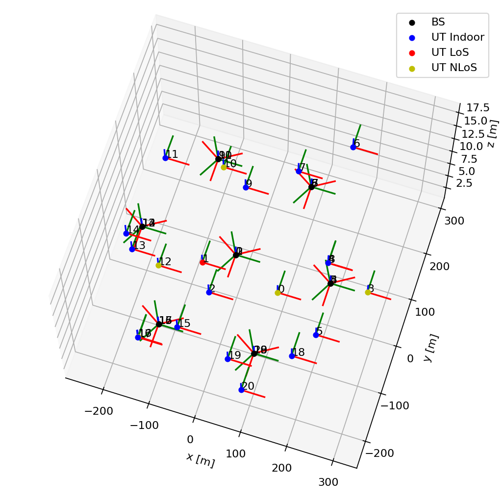

3GPP 38.901
===========

The submodule ``tr38901`` implements 3GPP channel models from TR 38.901
V16.1 and V19.2 :cite:p:`TR38901V160100,TR38901V1920`. The version V19.2 is the default
and recommended selection. Version V16.1 is retained for reproducing the calibration
reference results and older experiments.

The :class:`~sionna.phy.channel.tr38901.CDL`, :class:`~sionna.phy.channel.tr38901.UMi`,
:class:`~sionna.phy.channel.tr38901.UMa`, :class:`~sionna.phy.channel.tr38901.RMa`,
:class:`~sionna.phy.channel.tr38901.InH`, and
:class:`~sionna.phy.channel.tr38901.InF`
models require setting-up antenna models for the transmitters and
receivers. This is achieved using the
:class:`~sionna.phy.channel.tr38901.PanelArray` class.
For handheld UT antenna arrays defined by TR 38.901 Clause 7.3, use
:class:`~sionna.phy.channel.tr38901.HandheldUTArray`.

The :class:`~sionna.phy.channel.tr38901.UMi`,
:class:`~sionna.phy.channel.tr38901.UMa`, :class:`~sionna.phy.channel.tr38901.RMa`,
:class:`~sionna.phy.channel.tr38901.InH`, and
:class:`~sionna.phy.channel.tr38901.InF`
models require setting-up a network topology, specifying, e.g., the user
terminal (UT) and base-station locations, UT velocities, etc.
Topology generation is provided by :doc:`Sionna SYS </sys/index>`. The
:doc:`SYS topology helpers </sys/api/topology>` return tuples that can be
passed directly to
:meth:`~sionna.phy.channel.tr38901.SystemLevelChannel.set_topology`. In
particular, use :func:`~sionna.sys.gen_tr38901_multicell_topology` for TR
38.901 UMi/UMa calibration-style multi-cell drops,
:func:`~sionna.sys.gen_hexgrid_topology` for general UMi/UMa/RMa hexagonal-grid
drops, :func:`~sionna.sys.gen_tr38901_indoor_office_topology` for InH, and
:func:`~sionna.sys.gen_tr38901_indoor_factory_topology` for InF.
However, all models can be used with custom topologies as well.

Example
-------

The following example combines these components into a complete link-level
setup: a panel array for the base stations, a handheld array for the UTs, the
UMi model with spatial consistency enabled, and a topology helper that provides
the geometry.

.. code-block:: python

    import torch
    from sionna.phy.channel.tr38901 import HandheldUTArray, PanelArray, UMi
    from sionna.sys import gen_tr38901_multicell_topology

    device = "cuda:0" if torch.cuda.is_available() else "cpu"

    # The antenna arrays, the channel model, and the topology helper must all
    # use the same carrier frequency. It sets the wavelength that defines the
    # element spacing and it selects the frequency-dependent parameter tables.
    carrier_frequency = 3.5e9

    # Base-station array: 2x2 cross-polarized elements, i.e., eight ports,
    # with the sectorized element pattern of Table 7.3-1.
    bs_array = PanelArray(num_rows_per_panel=2,
                          num_cols_per_panel=2,
                          polarization="dual",
                          polarization_type="cross",
                          antenna_pattern="38.901",
                          carrier_frequency=carrier_frequency,
                          device=device)

    # UT array: handheld device of Clause 7.3 carrying four single-polarized
    # ports at the corner candidate locations of Figure 7.3-2.
    ut_array = HandheldUTArray(carrier_frequency=carrier_frequency,
                               polarization="single",
                               antenna_locations="tr38901-4",
                               antenna_pattern="38.901-handheld",
                               device=device)

    # The channel model owns the scenario parameter tables and the generation
    # pipeline. Spatial consistency correlates the LoS state and the
    # small-scale parameters of UTs that are close to each other, instead of
    # drawing them independently per UT.
    channel_model = UMi(carrier_frequency=carrier_frequency,
                        o2i_model="low",
                        ut_array=ut_array,
                        bs_array=bs_array,
                        direction="downlink",
                        enable_spatial_consistency=True,
                        device=device)

    # The topology helper builds the geometry: one ring of seven sites with
    # three sectors each, hence 21 base stations, and one UT dropped per
    # sector. It returns the tuple that set_topology expects, including the
    # indoor/outdoor states and the wraparound virtual base-station positions.
    topology = gen_tr38901_multicell_topology("umi",
                                              batch_size=1,
                                              num_ut_per_sector=1,
                                              carrier_frequency=carrier_frequency,
                                              num_rings=1,
                                              device=device)

    # Hand the geometry to the model. The large-scale parameters as well as the
    # cluster delays, powers, and angles are drawn here, and they are reused
    # until the topology is set again.
    channel_model.set_topology(*topology)

    # Visualize the resulting drop, including the LoS state of every UT with
    # respect to the base station selected by bs_index.
    channel_model.show_topology()

    # Sample channel impulse responses over 14 time steps spaced by 1/15 kHz.
    # h has shape [batch size, num_ut, num_ut_ant, num_bs, num_bs_ant,
    #              num_paths, num_time_samples] and holds the path
    # coefficients; tau has shape [batch size, num_ut, num_bs, num_paths] and
    # holds the path delays in seconds.
    h, tau = channel_model(num_time_samples=14, sampling_frequency=15e3)

   Topology produced by the example, seen from an elevated viewing angle. The
   seven sites of the single-ring layout each carry three co-located sectors,
   drawn as black markers with their local coordinate systems. UT markers
   distinguish indoor UTs from outdoor UTs in LoS and NLoS with respect to
   base station ``bs_index=0``.

Because all system-level models share the same interface, replacing
:class:`~sionna.phy.channel.tr38901.UMi` by
:class:`~sionna.phy.channel.tr38901.UMa`,
:class:`~sionna.phy.channel.tr38901.RMa`,
:class:`~sionna.phy.channel.tr38901.InH`, or
:class:`~sionna.phy.channel.tr38901.InF` only requires a matching topology and,
for some models, a different set of scenario-specific arguments.
Setting ``direction="uplink"`` swaps the roles of the two arrays, and the
resulting channel impulse responses can be turned into time-domain or
frequency-domain channel realizations as described in
:doc:`the wireless channel overview <index>`.

.. currentmodule:: sionna.phy.channel.tr38901

.. autosummary::
   :toctree: .

   PanelArray
   Antenna
   AntennaElement
   AntennaArray
   HandheldUTArray
   TDL
   CDL
   UMi
   UMa
   RMa
   InH
   InF

.. toctree::
   :maxdepth: 1
   :hidden:

   tr38901_spatial_consistency
   tr38901_blockage

