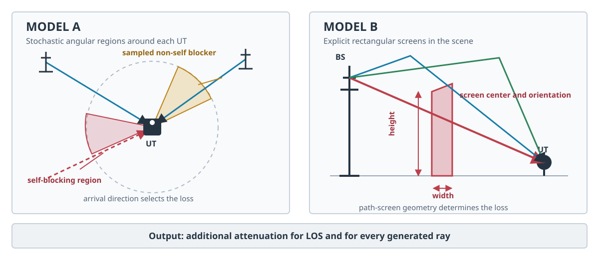

.. _tr38901-blockage:

Blockage
--------

.. currentmodule:: sionna.phy.channel.tr38901

The following helpers implement the two alternative blockage add-on models
from Section 7.6.4 of 3GPP TR 38.901
:cite:p:`TR38901V1920`:

* Model A is the stochastic angular-region model from Section 7.6.4.1. It
  generates generic self- and non-self-blocking regions around each UT and is
  computationally efficient.
* Model B is the geometric rectangular-screen model from Section 7.6.4.2. It
  uses explicitly positioned physical screens and computes attenuation for
  every ray, making it suitable for a specified blocker layout.

.. _tr38901-blockage-model-comparison:

   Model A samples self- and non-self-blocking angular regions around each UT.
   Model B evaluates explicitly positioned rectangular screens. Both produce
   additional attenuation for LOS and individual rays.

Blockage models additional attenuation caused by objects close to the UT or by
known physical screens that obstruct only some arrival directions or rays. It
is modelled separately from pathloss and shadow fading because these losses can
be direction-selective and different for LOS and individual multipath
components.

TR 38.901 defines temporal variability as an optional procedure that can be
activated on demand. That procedure is currently not supported: blockage
attenuation does not evolve over the time samples of a generated channel
realization.

Model A is available for :class:`~sionna.phy.channel.tr38901.UMi`,
:class:`~sionna.phy.channel.tr38901.UMa`,
:class:`~sionna.phy.channel.tr38901.RMa`, and
:class:`~sionna.phy.channel.tr38901.InH`. Model B is available for those models
and :class:`~sionna.phy.channel.tr38901.InF`.

.. list-table:: Blockage-model support
   :header-rows: 1
   :widths: 12 35 53

   * - Model
     - Channel classes
     - Required configuration
   * - A
     - UMi, UMa, RMa, InH
     - Explicit portrait or landscape self-blocking mode and the number of
       stochastic non-self-blockers.
   * - B
     - UMi, UMa, RMa, InH, InF
     - Explicit screen centre, width, and height for every physical blocker.

A compliant Model A realization includes one self-blocking region from Table
7.6.4.1-1, so public channels require an explicit ``"portrait"`` or
``"landscape"`` selection when Model A is enabled. The explicit value
``blockage_self_blocking="none"`` is available for experiments that
intentionally omit self-blocking, but this is a non-standard Model A variant.

InF intentionally supports only Model B. Tables 7.6.4.1-2 and 7.6.4.1-4
provide Model A blocker distributions and spatial-correlation distances for
UMi, UMa, SMa, RMa, and InH, but contain no InF parameters. In contrast, Table
7.6.4.2-5 explicitly recommends Model B dimensions and mobility patterns for
InF humans, automated guided vehicles, and industrial robots. Consequently,
``InF(enable_blockage=True, ...)`` always selects Model B and requires explicit
screen centres, widths, and heights. This is a standards-parameter restriction,
not a claim that stochastic blockage is physically impossible in a factory.

.. autosummary::
   :toctree: .

   BlockageModelA
   BlockageModelB

Examples
~~~~~~~~

Model A is selected by setting ``enable_blockage=True``. The following example
uses a UMi channel with the landscape self-blocking region from Table
7.6.4.1-1 of TR 38.901 :cite:p:`TR38901V1920`.

.. code-block:: python

   import math
   import torch
   from sionna.phy.channel import tr38901

   device = "cuda:0" if torch.cuda.is_available() else "cpu"
   precision = "single"
   dtype = torch.float32
   carrier_frequency = 30e9

   bs_array = tr38901.PanelArray(num_rows_per_panel=1,
                                 num_cols_per_panel=1,
                                 polarization="single",
                                 polarization_type="V",
                                 antenna_pattern="omni",
                                 carrier_frequency=carrier_frequency,
                                 precision=precision,
                                 device=device)
   ut_array = tr38901.PanelArray(num_rows_per_panel=1,
                                 num_cols_per_panel=1,
                                 polarization="single",
                                 polarization_type="V",
                                 antenna_pattern="omni",
                                 carrier_frequency=carrier_frequency,
                                 precision=precision,
                                 device=device)

   channel = tr38901.UMi(carrier_frequency=carrier_frequency,
                         o2i_model="low",
                         ut_array=ut_array,
                         bs_array=bs_array,
                         direction="downlink",
                         enable_blockage=True,
                         blockage_model="A",
                         blockage_self_blocking="landscape",
                         blockage_num_non_self_blockers=0,
                         precision=precision,
                         device=device)

   channel.set_topology(
       ut_loc=torch.tensor([[[100.0, 0.0, 1.5]]],
                           dtype=dtype,
                           device=device),
       bs_loc=torch.tensor([[[0.0, 0.0, 10.0]]],
                           dtype=dtype,
                           device=device),
       ut_orientations=torch.tensor([[[math.pi / 2, 0.0, 0.0]]],
                                    dtype=dtype,
                                    device=device),
       bs_orientations=torch.zeros(1, 1, 3, dtype=dtype, device=device),
       ut_velocities=torch.zeros(1, 1, 3, dtype=dtype, device=device),
       in_state=torch.zeros(1, 1, dtype=torch.bool, device=device),
       los=True)

   channel.return_rays = True
   h, tau, rays = channel(num_time_samples=1, sampling_frequency=1.0)

   print("Per-ray blockage loss shape:", tuple(rays.blockage_loss_db.shape))
   print("LOS blockage loss [dB]:", rays.los_blockage_loss_db.cpu())

This produces:

.. code-block:: text

   Per-ray blockage loss shape: (1, 1, 1, 19, 20)
   LOS blockage loss [dB]: tensor([[[30.]]])

The first output contains one loss value for each of the 19 clusters and 20
rays. The second output is the LOS-path loss for the single BS--UT link. For
this UT orientation, the LOS direction is inside the landscape self-blocking
region and therefore receives the specified 30 dB attenuation. Random
non-self-blockers are disabled here so that the example has deterministic
output.

Model B uses explicit rectangular blocker screens. The screen centre
coordinates, widths, and heights are in metres. In this example, the screen is
placed between the BS and UT so that both LOS and ray-level blockage losses can
be inspected through the returned
:class:`~sionna.phy.channel.tr38901.Rays` object.

.. code-block:: python

   import torch
   from sionna.phy.channel import tr38901

   device = "cuda:0" if torch.cuda.is_available() else "cpu"
   precision = "single"
   dtype = torch.float32
   carrier_frequency = 30e9

   bs_array = tr38901.PanelArray(num_rows_per_panel=1,
                                 num_cols_per_panel=1,
                                 polarization="single",
                                 polarization_type="V",
                                 antenna_pattern="omni",
                                 carrier_frequency=carrier_frequency,
                                 precision=precision,
                                 device=device)
   ut_array = tr38901.PanelArray(num_rows_per_panel=1,
                                 num_cols_per_panel=1,
                                 polarization="single",
                                 polarization_type="V",
                                 antenna_pattern="omni",
                                 carrier_frequency=carrier_frequency,
                                 precision=precision,
                                 device=device)

   channel = tr38901.UMi(
       carrier_frequency=carrier_frequency,
       o2i_model="low",
       ut_array=ut_array,
       bs_array=bs_array,
       direction="downlink",
       enable_blockage=True,
       blockage_model="B",
       blockage_screen_centers=torch.tensor([[80.0, 10.0, 1.5]],
                                            dtype=dtype,
                                            device=device),
       blockage_screen_widths=torch.tensor([2.0],
                                           dtype=dtype,
                                           device=device),
       blockage_screen_heights=torch.tensor([10.0],
                                            dtype=dtype,
                                            device=device),
       precision=precision,
       device=device)

   channel.set_topology(
       ut_loc=torch.tensor([[[100.0, 10.0, 1.5]]],
                           dtype=dtype,
                           device=device),
       bs_loc=torch.tensor([[[0.0, 0.0, 30.0]]],
                           dtype=dtype,
                           device=device),
       ut_orientations=torch.zeros(1, 1, 3, dtype=dtype, device=device),
       bs_orientations=torch.zeros(1, 1, 3, dtype=dtype, device=device),
       ut_velocities=torch.zeros(1, 1, 3, dtype=dtype, device=device),
       in_state=torch.zeros(1, 1, dtype=torch.bool, device=device),
       los=True)

   channel.return_rays = True
   h, tau, rays = channel(num_time_samples=1, sampling_frequency=1.0)

   print("Per-ray blockage loss shape:", tuple(rays.blockage_loss_db.shape))
   print("LOS blockage loss [dB]:", rays.los_blockage_loss_db.cpu())

This produces:

.. code-block:: text

   Per-ray blockage loss shape: (1, 1, 1, 19, 20)
   LOS blockage loss [dB]: tensor([[[0.0495]]])

Here the screen intersects the LOS path and causes approximately 0.05 dB of
LOS attenuation. The precise final digits can differ slightly between devices
and floating-point implementations.
