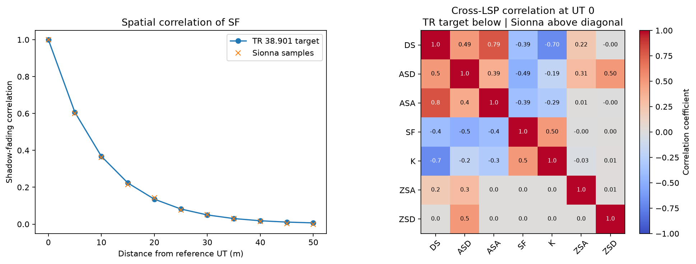

.. _tr38901-spatial-consistency:

Spatial Consistency
-------------------

.. currentmodule:: sionna.phy.channel.tr38901

The following helpers implement finite-dimensional correlation matrices by
evaluating the exponential normalized autocorrelation function from
Eq. (7.4-5), Section 7.4.4 of 3GPP TR 38.901
:cite:p:`TR38901V1920`, at all pairs
of terminal positions. This correlation law is used by the
spatial-consistency procedure of Sections 7.6.3.1 and 7.6.3.4.

Implementation Scope
~~~~~~~~~~~~~~~~~~~~

The implementation generates finite-dimensional random fields for the UT
locations in the current topology snapshot. Spatial filtering of the
large-scale parameters (LSPs) is always applied within each link state. Setting
``enable_spatial_consistency=True`` additionally correlates the sampled
LoS/NLoS states, applicable O2I random terms, and the small-scale random
variables used to generate clusters and rays. When blockage model A is
enabled, its blocker-centre fields use the same region partitioning.

This is static spatial consistency, not the stateful mobility procedure of
Section 7.6.3.2. Whenever a fresh realization is requested, a new random field
is sampled. In particular,
:meth:`SystemLevelChannel.sample_lsp` always returns a new LSP realization;
ordinary channel calls cache LSPs only when ``always_generate_lsp=False``.
Changing the topology recomputes the correlation matrices but does not evolve
or transport a previous random-field realization. UT velocities still produce
Doppler evolution over the time samples of one generated channel impulse
response, but they do not move the topology, update LoS/NLoS state, or perform
cluster birth and death.

When spatial consistency is enabled, the optional
``spatial_consistency_track_ids`` argument groups UT entries that represent
sampled positions on the same track *within one topology snapshot*.
Equal track IDs share the discrete cluster-angle signs and random ray-coupling
permutations. Track IDs do not preserve continuous or discrete random variables
across separate calls to :meth:`SystemLevelChannel.set_topology`.

Spatial Regions and Floors
~~~~~~~~~~~~~~~~~~~~~~~~~~

All spatial correlation matrices use horizontal UT separation. The optional
``ut_spatial_region_ids`` argument to
:meth:`SystemLevelChannel.set_topology` partitions the LSP fields and, when
spatial consistency is enabled, the additional LoS/NLoS, O2I, cluster, and ray
fields. Two UTs with unequal IDs have zero cross-correlation in those fields;
two UTs with the same ID remain correlated according to their 2D separation
and are not forced to have identical samples.

Region IDs are correlation labels only. They do not infer walls, add inter-floor
penetration loss, or alter pathloss or channel geometry. For InH and InF,
omitted IDs place every UT in one region, so users
must provide explicit IDs to decorrelate floors or separate buildings. For
UMi, UMa, and RMa, the initial default assigns indoor UTs to a 3 m floor grid
inferred from height and assigns outdoor UTs to region zero. That fallback does
not identify separate buildings; explicit IDs should therefore be unique for
each building-floor region. As with other omitted topology arguments, IDs from
the previous topology are reused on later calls, so they must be updated when a
UT changes region.

.. autosummary::
   :toctree: .

   spatial_consistency_correlation_matrix
   spatial_consistency_matrix_sqrt

Example
~~~~~~~

The following example configures a UMi channel with outdoor LoS UTs placed on
a line and repeatedly samples the seven large-scale parameters (LSPs): delay
spread (DS), azimuth spreads of departure and arrival (ASD and ASA), shadow
fading (SF), Rician K-factor (K), and zenith spreads of arrival and departure
(ZSA and ZSD). Each call to :meth:`SystemLevelChannel.sample_lsp` jointly
generates all seven parameters. The generator applies a 7-by-7 cross-LSP
correlation matrix within every BS-UT link and a separate spatial correlation
matrix for each LSP across the UT positions.

All samples are converted back to the log-domain because TR 38.901 applies
these correlations before mapping the LSPs to linear scale. The left plot
selects only SF and measures its spatial correlation between the reference UT
and the other UTs. For UMi LoS, the SF correlation distance is
:math:`D_\mathrm{SF}=10\,\mathrm{m}`, so the correlation should follow
:math:`\exp(-d/D_\mathrm{SF})`. The right plot instead fixes the reference UT
and compares the cross-correlation between all seven LSPs over repeated
samples with the UMi LoS target matrix. Target coefficients are shown below
the diagonal and empirical coefficients above it. The target cross-correlation
coefficients are identical in the V16.1 and V19.2 parameter tables.

The LSP spatial correlation shown here is part of the TR 38.901 LSP generation
step. Setting ``enable_spatial_consistency=True`` additionally enables
spatially consistent small-scale random fields for full channel generation.

.. code-block:: python

   import torch
   import matplotlib.pyplot as plt
   from sionna.phy import config
   from sionna.phy.channel.tr38901 import PanelArray, UMi

   config.seed = 7
   device = "cuda:0" if torch.cuda.is_available() else "cpu"
   dtype = torch.float32
   carrier_frequency = 3.5e9

   bs_array = PanelArray(num_rows_per_panel=1,
                         num_cols_per_panel=1,
                         polarization="single",
                         polarization_type="V",
                         antenna_pattern="omni",
                         carrier_frequency=carrier_frequency,
                         device=device)
   ut_array = PanelArray(num_rows_per_panel=1,
                         num_cols_per_panel=1,
                         polarization="single",
                         polarization_type="V",
                         antenna_pattern="omni",
                         carrier_frequency=carrier_frequency,
                         device=device)

   channel_model = UMi(carrier_frequency=carrier_frequency,
                       o2i_model="low",
                       ut_array=ut_array,
                       bs_array=bs_array,
                       direction="downlink",
                       enable_spatial_consistency=True,
                       device=device)

   num_ut = 11
   ut_x = torch.arange(20.0, 20.0 + 5.0*num_ut, 5.0,
                       dtype=dtype, device=device)
   ut_loc = torch.stack([ut_x,
                         torch.zeros_like(ut_x),
                         torch.full_like(ut_x, 1.5)], dim=-1).unsqueeze(0)

   channel_model.set_topology(
       ut_loc=ut_loc,
       bs_loc=torch.tensor([[[0.0, 0.0, 10.0]]],
                           dtype=dtype, device=device),
       ut_orientations=torch.zeros(1, num_ut, 3,
                                   dtype=dtype, device=device),
       bs_orientations=torch.zeros(1, 1, 3,
                                   dtype=dtype, device=device),
       ut_velocities=torch.zeros(1, num_ut, 3,
                                 dtype=dtype, device=device),
       in_state=torch.zeros(1, num_ut, dtype=torch.bool, device=device),
       los=True)

   lsp_names = ["DS", "ASD", "ASA", "SF", "K", "ZSA", "ZSD"]
   lsp_cross_target = torch.tensor([
       [ 1.0,  0.5,  0.8, -0.4, -0.7,  0.2,  0.0],
       [ 0.5,  1.0,  0.4, -0.5, -0.2,  0.3,  0.5],
       [ 0.8,  0.4,  1.0, -0.4, -0.3,  0.0,  0.0],
       [-0.4, -0.5, -0.4,  1.0,  0.5,  0.0,  0.0],
       [-0.7, -0.2, -0.3,  0.5,  1.0,  0.0,  0.0],
       [ 0.2,  0.3,  0.0,  0.0,  0.0,  1.0,  0.0],
       [ 0.0,  0.5,  0.0,  0.0,  0.0,  0.0,  1.0],
   ], dtype=dtype, device=device)

   lsp_log_samples = []
   for _ in range(10000):
       lsp = channel_model.sample_lsp()
       lsp_log_samples.append(torch.stack([
           torch.log10(lsp.ds[0, 0]),
           torch.log10(lsp.asd[0, 0]),
           torch.log10(lsp.asa[0, 0]),
           torch.log10(lsp.sf[0, 0]),
           torch.log10(lsp.k_factor[0, 0]),
           torch.log10(lsp.zsa[0, 0]),
           torch.log10(lsp.zsd[0, 0]),
       ], dim=-1))
   lsp_log_samples = torch.stack(lsp_log_samples, dim=0)

   # Spatial SF correlation: correlate UT 0 with every other UT.
   sf_spatial = torch.corrcoef(lsp_log_samples[:, :, 3].T)[0]
   distance = torch.abs(ut_x - ut_x[0])
   sf_target = torch.exp(-distance/10.0)

   # Cross-LSP correlation: correlate the seven LSPs at UT 0.
   lsp_cross = torch.corrcoef(lsp_log_samples[:, 0, :].T)
   max_error = torch.max(torch.abs(lsp_cross-lsp_cross_target))
   print(f"Maximum cross-correlation error: {max_error.item():.3f}")

   fig, axes = plt.subplots(1, 2, figsize=(12, 4.5),
                            constrained_layout=True)
   axes[0].plot(distance.cpu(), sf_target.cpu(), "o-",
                label="TR 38.901 target")
   axes[0].plot(distance.cpu(), sf_spatial.cpu(), "x",
                label="Sionna samples")
   axes[0].set_xlabel("Distance from reference UT (m)")
   axes[0].set_ylabel("Shadow-fading correlation")
   axes[0].set_title("Spatial correlation of SF")
   axes[0].legend()

   # Combine both symmetric matrices: target below the diagonal and
   # empirical values above it.
   lsp_cross_combined = (
       torch.tril(lsp_cross_target)
       + torch.triu(lsp_cross, diagonal=1)
   )
   image = axes[1].imshow(lsp_cross_combined.cpu(), vmin=-1.0, vmax=1.0,
                          cmap="coolwarm")
   axes[1].set_xticks(range(7), lsp_names, rotation=45)
   axes[1].set_yticks(range(7), lsp_names)
   axes[1].set_title("Cross-LSP correlation at UT 0\n"
                     "TR target below | Sionna above diagonal")
   for row in range(7):
       for column in range(7):
           value = lsp_cross_combined[row, column].item()
           value_format = ".1f" if row >= column else ".2f"
           color = "white" if abs(value) > 0.55 else "black"
           axes[1].text(column, row, format(value, value_format),
                        ha="center", va="center", color=color,
                        fontsize=7)
   fig.colorbar(image, ax=axes[1], label="Correlation coefficient")
   plt.show()

   Left: empirical UMi LoS shadow-fading spatial correlation compared to the
   TR 38.901 target for UTs spaced by 5 m. Right: cross-correlation between the
   seven LSPs at the reference UT, with theoretical coefficients below the
   diagonal and empirical coefficients above it.
