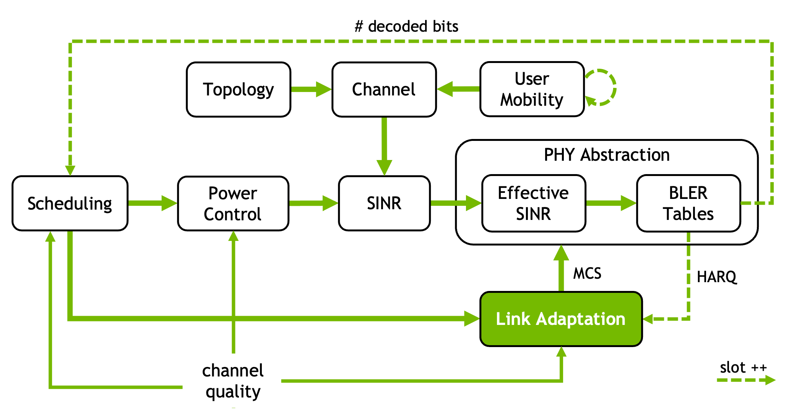

Link Adaptation
===============

Link adaptation (LA) optimizes the performance of a single wireless link by
dynamically adjusting transmission parameters to match time-varying channel
conditions.   

The objective is to maximize the achieved throughput while maintaining the
transport block error rate (TBLER) sufficiently low.  
Typically, this is simplified to maintaining the TBLER close to a
predefined target, designed to balance throughput and
latency.  

The main challenge lies in handling noisy and sparse SINR
feedback, which is used to estimate the channel quality.

For a usage example of link adaptation in Sionna, we refer to the `Link Adaptation
notebook <../tutorials/LinkAdaptation.html>`_. 

.. autoclass:: sionna.sys.InnerLoopLinkAdaptation
    :members:
    :exclude-members: call, build

.. autoclass:: sionna.sys.OuterLoopLinkAdaptation
    :members: 
    :exclude-members: call, build

.. _mcs_table_cat_note:

Note
----

The concepts of MCS table index, category, code block and transport blocks
are inspired by but not necessarily tied to 3GPP standards. 
It is assumed that:

- Each MCS category has multiple table indices, each defining the mapping
  between MCS indices and their corresponding modulation orders and coding rates.
  Such relationships are defined by ``sinr_effective_fun``; 

- The transport block, which serves as main data unit, is divided into multiple
  code blocks. The number and size of these code blocks are computed by
  ``transport_block_fun``. 

Yet, if neither ``sinr_effective_fun`` nor ``transport_block_fun`` is provided,
this class aligns with 3GPP TS 38.214 ([3GPP38214]_), 
specifically Section 5.1.3 (PUSCH) and Section 6.1.4 (PDSCH).
In this case, the MCS category refers to PDSCH (category = 1) and PUSCH (0). 
Valid table `indices` are {1, 2} for PUSCH and {1, 2, 3, 4} for PDSCH.
For more information, refer to :class:`~sionna.phy.nr.TBConfig`. 

References:
    .. [Pedersen05] K. I. Pedersen, G. Monghal, I. Z. Kovacs, T. E. Kolding, A.
          Pokhariyal, F. Frederiksen, P. Mogensen. "Frequency domain scheduling
          for OFDMA with limited and noisy channel feedback," IEEE
          Vehicular Technology Conference (VTC), pp. 1792-1796, Sep. 2007.

    .. [Sampath97] A. Sampath K. P. Sarath, J. M. Holtzman. "On
          setting reverse link target SIR in a CDMA system." 1997 IEEE 47th Vehicular
          Technology Conference. Technology in Motion. Vol. 2. IEEE, 1997.  
