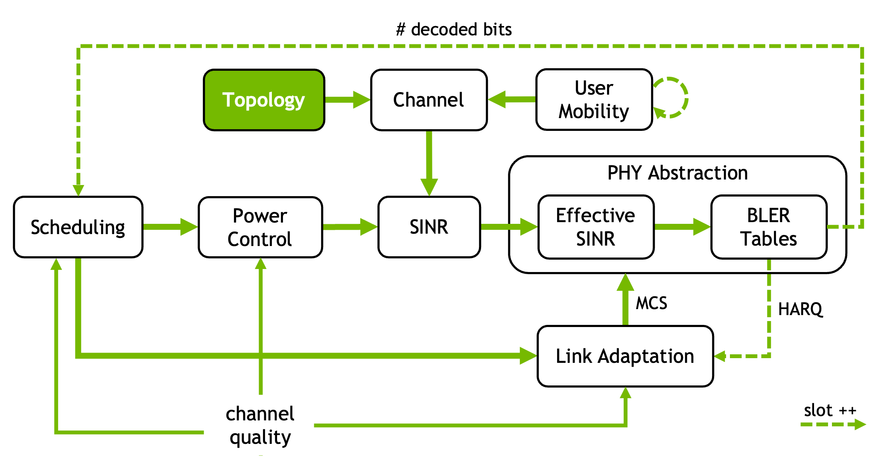

Multicell Topology
==================

.. currentmodule:: sionna.sys

In system-level simulations with 3GPP channel modeling, it is customary to place
cells on a spiral hexagonal grid. The grid is defined by the inter-site distance,
determining the distance between any two adjacent hexagonal cell centers, and
the number of rings of the grid, typically 1 or 2 (corresponding to 7 and 19
cells, hence 21 and 57 base stations, respectively).

To eliminate edge effects that would result in users at the cell borders
experiencing reduced interference levels, the grid is usually
wrapped around to create a seamless topology.

To learn how to place base stations and drop users on a hexagonal grid in
Sionna, refer to the `Hexagonal Grid Topology notebook <../tutorials/notebooks/HexagonalGrid.ipynb>`_.

The 3GPP TR 38.901 calibration helpers additionally provide the indoor-office
and indoor-factory drops used by the InH and InF channel models. Their results
are tuple-compatible and can be passed directly to the corresponding
``set_topology`` method. The indoor-factory helper returns an
:class:`IndoorFactoryTopology`, which also records the resolved InF
sub-scenario and hall dimensions. For non-default hall dimensions, configure
``InF`` with this metadata and call ``topology.set_topology(channel_model)`` to
validate the channel-statistics geometry before applying the deployment.

.. autosummary::
   :toctree: .

   Hexagon
   HexGrid
   IndoorFactoryTopology
   gen_hexgrid_topology
   gen_tr38901_multicell_topology
   gen_tr38901_indoor_office_topology
   gen_tr38901_indoor_factory_topology
   get_num_hex_in_grid
   convert_hex_coord
