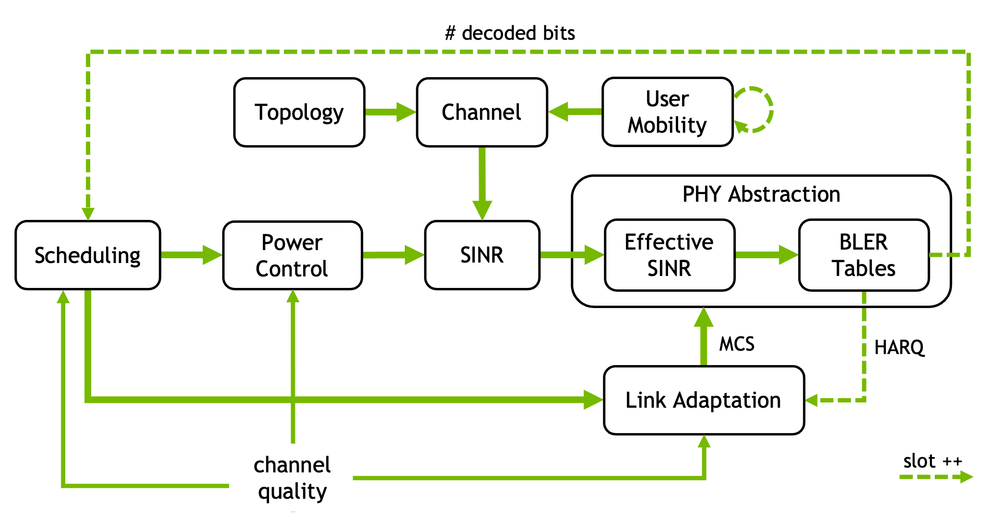

System Level (SYS)
==================

This package provides differentiable system-level simulation functionalities for multi-cell networks.

It is based on a :doc:`physical layer abstraction <api/abstraction>` that
computes the block error rate (BLER) from the
:class:`~sionna.phy.ofdm.PostEqualizationSINR`. It further includes Layer-2
functionalities, such as
:doc:`link adaptation (LA) <api/link_adaptation>` for adaptive modulation and
coding scheme (MCS) selection, downlink and uplink
:doc:`power control <api/power_control>`, and
:doc:`user scheduling <api/scheduling>`.

Sionna SYS also provides :doc:`network-topology generation utilities
<api/topology>` for outdoor UMi, UMa, and RMa hexagonal grids, TR 38.901
multi-cell calibration layouts, and indoor-office and indoor-factory
deployments. These utilities generate BS and UT locations and related topology
state, including wraparound virtual BS locations where applicable. Their
outputs can be passed directly to
:meth:`~sionna.phy.channel.tr38901.SystemLevelChannel.set_topology`.

A good starting point for Sionna SYS is the available
:doc:`tutorials <tutorials/index>` page.

.. toctree::
   :hidden:
   :maxdepth: 3

   tutorials/index
   api/sys.rst
   references
